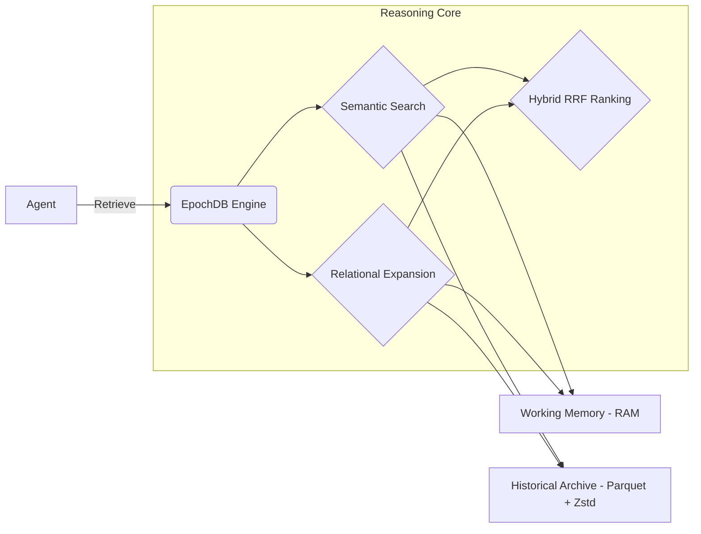

# EpochDB

**EpochDB** is an **ACID-compliant** agentic memory engine designed for lossless, tiered verbatim storage and multi-hop retrieval.

## Why
I had this idea while playing with LMDB. I wanted to create a memory system that could store conversations in a hybrid way, using in-memory for the most recent conversations and on-disk for older conversations. So, in order to have immutable data, I decided to use Parquet files for the on-disk storage. 

## Overview
Traditional AI memory systems compress conversations through destructive summarization. EpochDB bypasses this constraint by storing "Unified Memory Atoms"—the raw text intrinsically paired with dense embeddings.

EpochDB uses a tiered architecture reminiscent of CPU caching:
1. **L1: Working Memory**: Sub-millisecond HNSW vector index in RAM.
2. **L2: Historical Archive**: Cold storage in immutable, time-partitioned `.parquet` files via PyArrow, leveraging **int8 Scalar Quantization** and **Zstd Compression** for a massive reduction in disk footprint.
3. **Asynchronous Ingestion**: Ingestion occurs via daemon threads, preventing I/O bottlenecks and ensuring smooth agent responsiveness.

It uniquely handles multi-hop retrieval over time-partitioned data using a **Global Entity Index**.

## Architecture at a Glance



## Installation

```bash
pip install epochdb
```

## Quickstart: LangGraph + EpochDB

Integrate EpochDB into your **LangGraph** workflows to provide agents with perfect, multi-hop memory that persists across lifetimes.

```python
from epochdb import EpochDB
from langgraph.graph import StateGraph, END

# 1. Initialize EpochDB (e.g., 3072D for Gemini 2.0)
db = EpochDB(storage_dir="./agent_memory", dim=3072)

# 2. Define a Retrieval Node with Relational Expansion (Multi-Hop)
def retrieve_memory(state):
    # query_emb: np.ndarray from your embedder
    # expand_hops=2: Bridges logical gaps (e.g., Jeff -> Project -> Tech)
    results = db.recall(query_emb, top_k=3, expand_hops=2)
    context = "\n".join([r.payload for r in results])
    return {"context": context}

# 3. Define a Storage Node (Atom + KG Triples)
def store_memory(state):
    db.add_memory(
        payload=f"User said: {state['input']}",
        embedding=input_vector,
        triples=[("user", "mentioned", "EpochDB")] # Builds the KG
    )
    return state
```

> [!TIP]
> **Tiered Persistence**: Unlike standard vector stores, EpochDB automatically manages the lifecycle of these memories, flushing them to immutable **Parquet files** (Cold Tier) while keeping the most relevant atoms in **RAM** (Hot Tier).

> [!TIP]
> **Native LangGraph Checkpointer**: EpochDB now includes a built-in checkpointer. You can persist your entire graph state (thread context) directly in the same EpochDB storage directory using `EpochDBCheckpointer(db)`.

## Performance & Comparison

EpochDB is engineered specifically for **Agentic workflows** where logical continuity across long horizons is critical. In side-by-side benchmarks against industry standards, EpochDB remains the only local engine capable of complex multi-hop reasoning.

| Benchmark | Store | Metrics | Note |
| :--- | :--- | :--- | :--- |
| **LoCoMo** | **EpochDB** | **recall: 1.000** | **100% Multi-hop Accuracy** |
| | ChromaDB | recall: 0.000 | Failed to connect related events |
| | Qdrant | recall: 0.000 | Failed to connect related events |
| **ConvoMem**| EpochDB | recall@3: 1.000 | Perfect Semantic retrieval |
| | FAISS | recall@3: 1.000 | Perfect Semantic retrieval |

> [!IMPORTANT]
> **Relational Expansion**: While tools like FAISS and ChromaDB are excellent for single-turn semantic search, they act as "flat" stores. EpochDB leverages its integrated **Knowledge Graph** to bridge logical gaps, successfully navigating multi-hop queries where competitors fail completely.

## Changelog
For a detailed history of changes, see [CHANGELOG.md](CHANGELOG.md).

### Recent Highlights (v0.2.x)
- **Asynchronous Tiering**: Background flushes prevent I/O blocking.
- **Superior Compression**: Combined INT8 Quantization and Zstd reduces disk footprint by >4x.
- **Robust Multi-Hop Retrieval**: UUID-based epoch tracking and expanded candidate gathering ensure 100% recall on longitudinal benchmarks.
- **LangGraph Native**: Dynamic state persistence via built-in checkpointers.

## How It Works
See [`how_it_works.md`](how_it_works.md) for a detailed technical dive into the tiered architecture and ACID-compliant transactional layer.

## Benchmarks & Examples
*   **[benchmark.md](benchmark.md)**: Full 5-way comparative analysis vs. Chroma, Lance, FAISS, and Qdrant.
*   **[example_langgraph.py](example_langgraph.py)**: A complete, multi-session agent implementation.
*   **[demo.py](demo.py)**: An interactive "Detective Story" proving Relational Expansion logic.
