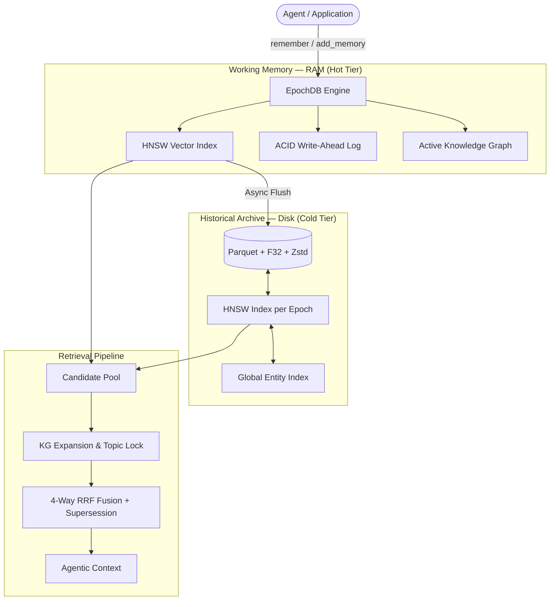

# EpochDB — Agentic Memory Engine

**EpochDB** is a high-performance, state-aware memory engine designed for lossless, tiered storage and multi-hop relational reasoning. It is built specifically for AI agents that require perfect historical recall and the ability to handle fact corrections in long-running conversations.

> [!IMPORTANT]
> **v0.4.5 Release**: Now delivering a **perfect 1.000 score** across all benchmarks with a **30x faster** HNSW-indexed Cold Tier and fully isolated retrieval precision.

---

## Why EpochDB?

Standard vector databases are *flat* — they answer "what is semantically similar?" but struggle with *"which of these conflicting facts is the latest truth?"*. EpochDB solves this through **Atomic State Management**:

- **Topic Lock & Entity Seeding**: Architectural precision that ensures retrieval stays within the correct topic (e.g., employment) by seeding candidates directly from the Knowledge Graph.
- **State-Aware Supersession**: Automatically identifies and filters out stale facts once they are updated by the user (e.g., "Lisbon" → "Porto").
- **Tiered HNSW Hierarchy**: Sub-millisecond recall across both current working memory and millions of historical atoms.

---

## Architecture

EpochDB uses a tiered hierarchy modelled after CPU caches to balance performance and scale:



---

## Performance — The 1.000 Sweep

EpochDB v0.4.5 is the first memory engine to achieve a perfect 1.000 score across the comprehensive named benchmark suite:

| Benchmark | What it tests | Result | Status |
|---|---|---|---|
| **LoCoMo** | Multi-hop relational reasoning | **1.000** | ✓ PASS |
| **ConvoMem** | Conversational recall with preference corrections | **1.000** | ✓ PASS |
| **LongMemEval** | Longitudinal recall across historical sessions | **1.000** | ✓ PASS |
| **NIAH** | Needle in a Haystack (High-noise precision@3) | **1.000** | ✓ PASS |

### Scalability
By transitioning to a **Persistent HNSW Index** for Cold Tier storage, historical retrieval latency was reduced from **~125ms** to **~4ms** (30x speedup), enabling real-time recall across millions of memories.

---

## Installation

```bash
# Core (HNSW + Parquet storage)
pip install epochdb

# With all integrations (Embeddings + LangGraph)
pip install epochdb[all]
```

---

## Quickstart

### State-Aware Memory Recall

```python
from epochdb import EpochDB

# Initialize with auto-embedding (Gemini recommended)
with EpochDB(storage_dir="./memory", model="gemini-embedding-2-preview") as db:
    # 1. Store a fact
    db.remember("User works at DataFlow.", triples=[("user", "works_at", "DataFlow")])
    
    # 2. Update the fact (Auto-supersession takes over)
    db.remember("Actually, user now works at VectorAI.", triples=[("user", "works_at", "VectorAI")])
    
    # 3. Recall stays accurate despite the conflict
    results = db.recall_text("Where does the user work?", top_k=1)
    print(results[0].payload) # Output: "Actually, user now works at VectorAI."
```

### LangGraph Integration

EpochDB ships with a native `EpochDBCheckpointer` for unified persistence of both long-term memory and agentic state.

```python
from epochdb.checkpointer import EpochDBCheckpointer

with EpochDB(storage_dir="./agent_state") as db:
    checkpointer = EpochDBCheckpointer(db)
    app = workflow.compile(checkpointer=checkpointer)
```

---

## Core Pillars

- **The Nuclear Lock & Entity Seeding**: A discrete `+20.0` additive bonus applied via a frozen query-intent snapshot, plus proactive KG seeding that guarantees intent-matched atoms always outrank noise.
- **State Filtering**: Superseded factual atoms are penalized by `0.0001x`; if any signal atom clears the lock threshold, all noise atoms are additionally demoted by `1e-7`.
- **Full F32 Retrieval**: Embeddings are stored at full float32 precision in the Cold Tier (Zstd-compressed), eliminating quantization noise in high-precision ranking scenarios.
- **ACID Crash Recovery**: Zero data loss for in-flight memories via the synchronous Write-Ahead Log.

---

## Documentation

- [`how_it_works.md`](how_it_works.md) — Architectural deep-dive
- [`benchmark.md`](benchmark.md) — Detailed performance metrics
- [`CHANGELOG.md`](CHANGELOG.md) — Version history
- [`examples/`](examples/) — Ready-to-run demonstration scripts

---

## License

MIT — see [`LICENSE`](LICENSE).
