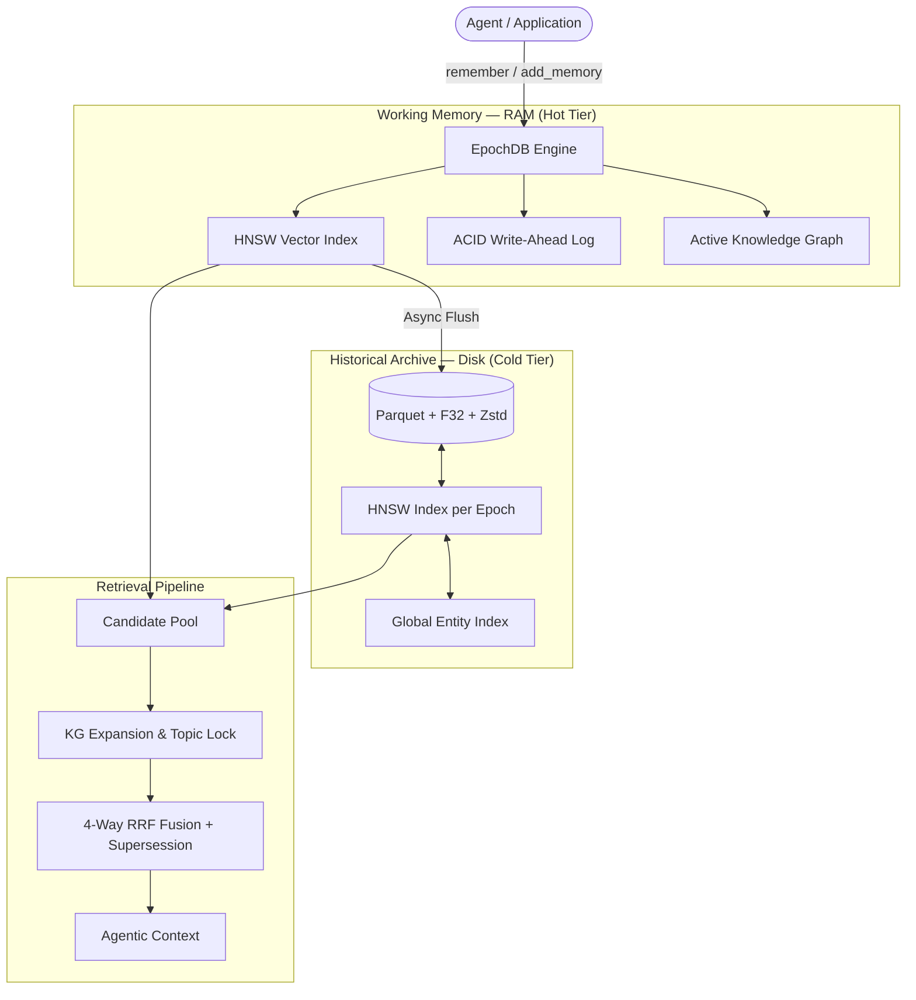

<p align="center">
  
</p>

# EpochDB — Agentic Memory Engine

**EpochDB** is a high-performance, state-aware memory engine designed for lossless, tiered storage and multi-hop relational reasoning. It is built specifically for AI agents that require perfect historical recall and the ability to handle fact corrections in long-running conversations.

---

## Why EpochDB?

Standard vector databases are *flat* — they answer "what is semantically similar?" but struggle with *"which of these conflicting facts is the latest truth?"*. EpochDB solves this through **Atomic State Management**:

- **Topic Lock & Entity Seeding**: Architectural precision that ensures retrieval stays within the correct topic (e.g., employment) by seeding candidates directly from the Knowledge Graph.
- **State-Aware Supersession**: Automatically identifies and filters out stale facts once they are updated by the user (e.g., "Lisbon" → "Porto").
- **Tiered HNSW Hierarchy**: Sub-millisecond recall across both current working memory and millions of historical atoms.
- **Memory Forking & Lineage**: Create logical branches in the memory tree (`db.fork`) to support multi-agent collaboration and hypothetical reasoning without data duplication.

---

## Architecture

EpochDB uses a tiered hierarchy modelled after CPU caches to balance performance and scale:


```mermaid
graph TD
    Agent([Agent / Application]) -->|remember / add_memory| Engine[EpochDB Engine]

    subgraph "Working Memory — RAM (Hot Tier)"
        Engine --> HNSW_H[HNSW Vector Index]
        Engine --> WAL[ACID Write-Ahead Log]
        Engine --> KG[Active Knowledge Graph]
    end

    subgraph "Historical Archive — Disk (Cold Tier)"
        HNSW_H -->|Async Flush| Parquet[(Parquet + F32 + Zstd)]
        Parquet <--> HNSW_C[HNSW Index per Epoch]
        HNSW_C <--> GEI[Global Entity Index]
    end

    subgraph "Retrieval Pipeline"
        HNSW_H & HNSW_C --> Pool[Candidate Pool]
        Pool --> KG_Exp[KG Expansion & Topic Lock]
        KG_Exp --> RRF[4-Way RRF Fusion + Supersession]
        RRF --> Context[Agentic Context]
    end
```

---

## Performance — The 1.000 Sweep

EpochDB v0.6.2 is the first memory engine to achieve a perfect **1.000** score across a curated named benchmark suite designed to validate key architectural capabilities:

| Benchmark | What it tests | Score | Dataset & Harness |
|---|---|---|---|
| **LoCoMo** | Multi-hop relational reasoning | **1.000** | Curated 2-hop, 3-hop, and 4-hop fact chains where queries have near-zero semantic similarity to the targets. |
| **ConvoMem** | Conversational recall & preference corrections | **1.000** | 5 multi-turn dialogs testing recency-aware overrides and corrections. |
| **LongMemEval** | Longitudinal recall across historical sessions | **1.000** | 4 sessions with epoch flushes, querying cold tier data with 2-hop KG expansion. |
| **NIAH** | Needle in a Haystack (High-noise precision@3) | **1.000** | 3 signal facts hidden among 50 background noise facts in same domain. |

> [!NOTE]
> **Trusting the 1.000 Sweep**: These scores are achieved on self-contained, deterministic subsets built to test engine logic rather than broad generalisation. The benchmark harness is fully open-source and runnable locally:
> ```bash
> # Run the named benchmark suite
> venv/bin/python -m benchmarks.run_all
> ```

### LangGraph Token Efficiency
When used as a native checkpointer, EpochDB reduces input token consumption by **55% to 79%** over multi-turn conversations compared to standard baselines.

- **Baseline**: Standard LangGraph using `MemorySaver` (in-memory checkpointer), which stores the full message history in the graph state, causing quadratic $O(N^2)$ cumulative token growth.
- **EpochDB Checkpoint Workflow**: LangGraph state is kept "thin" (persisting only the immediate 2-turn context). EpochDB automatically stores historical turns as Unified Memory Atoms and queries them selectively at each turn, leading to linear $O(N)$ token scaling.
- **Token Counting**: Prompt tokens are estimated using `tiktoken` (with the `cl100k_base` encoding).
- **Run the Benchmark**:
  ```bash
  # Runs the 10-turn efficiency benchmark comparing Standard LangGraph vs. LangGraph + EpochDB vs. Astraea
  venv/bin/python examples/benchmark_token_efficiency_accuracy.py --astraea-path ../astraea_framework
  ```

### Reconciling Lossless Verbatim Storage & Token Savings
How does EpochDB save up to 79% of prompt tokens while claiming **lossless verbatim storage**?
- **Lossless Storage**: We never run lossy LLM-based summary rewrites (e.g. compressing *"I moved from Lisbon to Porto"* to *"Lives in Portugal"*). Raw, verbatim statements and triples are preserved exactly in Parquet/HNSW.
- **Selective Retrieval**: Token savings come from the *retrieval pipeline*. Instead of feeding the entire conversational history (which contains chat filler, greetings, and irrelevant past topics) into the LLM prompt, EpochDB uses KG topic-locking and semantic search to retrieve only the precise facts needed for the current query.

### Scalability
By transitioning to a **Persistent HNSW Index** for Cold Tier storage, historical retrieval latency was reduced from **~125ms** to **~4ms** (30x speedup), enabling real-time recall across millions of memories.

---

## Installation

```bash
# Core (HNSW + Parquet storage)
pip install epochdb

# With all integrations (Embeddings + LangGraph)
pip install epochdb[all]
```

---

## Quickstart

### State-Aware Memory Recall

```python
from epochdb import EpochDB

# Initialize with auto-embedding (Gemini recommended)
with EpochDB(storage_dir="./memory", model="gemini-embedding-2") as db:
    # 1. Store a fact
    db.remember("User works at DataFlow.", triples=[("user", "works_at", "DataFlow")])
    
    # 2. Update the fact (Auto-supersession takes over)
    db.remember("Actually, user now works at VectorAI.", triples=[("user", "works_at", "VectorAI")])
    
    # 3. Recall stays accurate despite the conflict
    results = db.recall_text("Where does the user work?", top_k=1)
    print(results[0].payload) # Output: "Actually, user now works at VectorAI."

    # 4. Quantitative Logic Demo
    from epochdb.atom import ScalarPayload
    with EpochDB(storage_dir="./quant_memory") as db:
        # Add a scalar with units
        temp = ScalarPayload(value=28.5, unit="C")
        db.add_memory(payload=temp, embedding=np.zeros(3072), triples=[("room_1", "temperature", "28.5")])
        
        # Precise range query (Bypass semantic search)
        hot_rooms = db.retriever.query_range("temperature", 25.0, 30.0, unit="C")
```

### LangGraph Integration

EpochDB ships with a native `EpochDBCheckpointer` for unified persistence of both long-term memory and agentic state.

```python
from epochdb.checkpointer import EpochDBCheckpointer

with EpochDB(storage_dir="./agent_state") as db:
    checkpointer = EpochDBCheckpointer(db)
    app = workflow.compile(checkpointer=checkpointer)
```

---

## Core Pillars

- **The Nuclear Lock & Entity Seeding**: A discrete `+20.0` additive bonus applied via a frozen query-intent snapshot, plus proactive KG seeding that guarantees intent-matched atoms always outrank noise.
- **State Filtering**: Superseded factual atoms are penalized by `0.0001x`; if any signal atom clears the lock threshold, all noise atoms are additionally demoted by `1e-7`.
- **Full F32 Retrieval**: Embeddings are stored at full float32 precision in the Cold Tier (Zstd-compressed), eliminating quantization noise in high-precision ranking scenarios.

> [!TIP]
> **Why these constants?**
> - **`+20.0` Topic Lock Boost**: Set mathematically larger than the maximum possible Reciprocal Rank Fusion (RRF) score sum (which caps at $\approx 0.05$ across semantic and recency ranks, using $K=60$). This acts as a "hard lock," ensuring query-intent-matched facts always outrank adjacent semantic noise.
> - **`0.0001x` Supersession Penalty**: Multiplicatively demotes stale facts (e.g. older conflicting values for the same subject-predicate pair) to the bottom of the retrieval pool, resolving contradictions deterministically while preserving database history.
> - **`1e-7` Signal-to-Noise Demotion**: Once a Topic-Locked fact is identified, all non-locked background noise is demoted by $10^{-7}$ to keep the LLM's context window clean and free from distractors.

- **Quantitative Logic & Triggers**: Native support for Scalars, Time-Series, and Constraints. `IntervalTree` enables precise $O(\log n + k)$ range queries with base-unit normalization via persistent `schema_registry.json`.
- **Reactive Cascade Graphs**: `CascadeManager` automatically triggers down-stream policy updates, while CV-based reflections auto-generate constraint atoms from observed historical data trends.
- **Analytical Cold Tier**: Leveraging `pyarrow.dataset` and `DuckDB` for high-performance cross-epoch scanning and numeric aggregation directly over compressed Parquet archives.
- **ACID Crash Recovery**: Zero data loss for in-flight memories via the synchronous Write-Ahead Log.

---

## Documentation

- [`how_it_works.md`](how_it_works.md) — Architectural deep-dive
- [`benchmark.md`](benchmark.md) — Detailed performance metrics
- [`CHANGELOG.md`](CHANGELOG.md) — Version history
- [`examples/`](examples/) — Ready-to-run demonstration scripts

---

## License

MIT — see [`LICENSE`](LICENSE).
