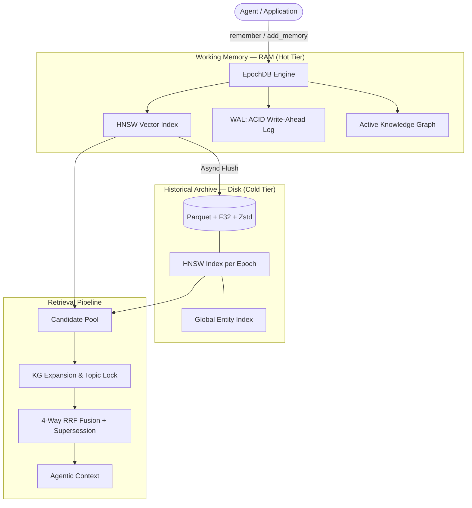

<p align="center">
  
</p>

# EpochDB — Agentic Memory Engine [](https://pepy.tech/projects/epochdb)


**EpochDB** is a high-performance, state-aware memory engine designed for lossless, tiered storage, atomic state management, and multi-hop relational reasoning. It is built specifically for AI agents that require perfect historical recall, long-term state persistence, and deterministic fact corrections.

---

## Why EpochDB?

Flat vector databases retrieve text based on semantic similarity but struggle to resolve conflicting facts (e.g. *"where does the user work now?"* vs *"where did they work last year?"*). EpochDB solves this through **Atomic State Management**:

- **Topic Lock & Entity Seeding**: Ensures retrieval stays within the target topic by seeding candidates directly from the Knowledge Graph.
- **State-Aware Supersession**: Automatically identifies and filters out stale facts when they are updated.
- **Tiered HNSW Hierarchy**: Sub-millisecond recall across working memory (L1 RAM) and historical archives (L2 Disk).
- **Memory Forking & Lineage**: Supports logical branches (`db.fork`) for multi-agent collaboration and hypothetical reasoning without copying data.
- **Rich Domain Objects**: Returns structured `Memory`, `Entity`, and `Graph` abstractions rather than raw database tuples.

---

## Architecture

EpochDB uses a tiered hierarchy modeled after CPU caches to balance low latency and massive scale:


```mermaid
graph TD
    Agent([Agent / Application]) -->|remember / add_memory| Engine[EpochDB Engine]

    subgraph "Working Memory — RAM (Hot Tier)"
        Engine --> HNSW_H[HNSW Vector Index]
        Engine --> WAL[WAL: ACID Write-Ahead Log]
        Engine --> KG[Active Knowledge Graph]
    end

    subgraph "Historical Archive — Disk (Cold Tier)"
        HNSW_H -->|Async Flush| Parquet[(Parquet + F32 + Zstd)]
        Parquet --- HNSW_C[HNSW Index per Epoch]
        HNSW_C --- GEI[Global Entity Index]
    end

    subgraph "Retrieval Pipeline"
        HNSW_H --> Pool[Candidate Pool]
        HNSW_C --> Pool
        Pool --> KG_Exp[KG Expansion & Topic Lock]
        KG_Exp --> RRF[4-Way RRF Fusion + Supersession]
        RRF --> Context[Agentic Context]
    end
```

---

## Performance, Latency & Token Efficiency

### 1. The 1.000 Sweep Benchmark
EpochDB achieves a perfect **1.000** score across named benchmark suites designed to validate engine logic:

| Benchmark | What it tests | Metric | Score |
|---|---|---|---|
| **LoCoMo** | Multi-hop relational reasoning | Multi-hop recall | **1.000** |
| **ConvoMem** | Fact correction & preference recall | recall@3 | **1.000** |
| **LongMemEval** | Longitudinal recall (cross-epoch) | recall@3 | **1.000** |
| **NIAH** | Needle in a Haystack (High-noise) | precision@3 | **1.000** |

*Run the benchmark suite locally:*
```bash
venv/bin/python -m benchmarks.run_all
```

### 2. Operational Latency
Precision metrics across Hot and Cold tiers:
- **Direct/Multi-Hop Relational Retrieval (Hot Tier)**: **0.2 ms – 0.4 ms**
- **Historical HNSW Retrieval (Cold Tier)**: **~4.0 ms** (30x speedup from ~125 ms via persistent indexing)
- **Cold Tier Full Scan (`pyarrow.dataset`)**: **45.0 ms** (for cross-epoch scalar aggregations)
- **Scalar Range Query (B-tree)**: **0.8 ms**
- **Series Interpolation (IntervalTree)**: **1.2 ms**
- **Constraint Satisfaction (Z3 SAT Solver)**: **2.5 ms**
- **WAL Crash Recovery Replay**: **9.1 ms**

### 3. LangGraph Token Savings
When used as a checkpointer, EpochDB keeps LangGraph states "thin" by storing historical turns as Unified Memory Atoms and querying them selectively. This achieves **linear $O(N)$ token scaling** (saving **55% to 79%** of input tokens compared to standard checkpointers' quadratic $O(N^2)$ accumulation).

### 4. Sync vs. Async Concurrency Benchmark
This benchmark evaluates E2E latency and input token consumption under concurrent multi-user load, comparing three execution configurations using the live Gemini API (`gemini-embedding-2` and `gemini-3-flash-preview`):
1. **Sync LangGraph + Sync EpochDB**: Sequential graph invocation with blocking I/O.
2. **Async LangGraph + Async EpochDB**: Concurrent graph execution (`ainvoke`) using async checkpointers and DB facades.
3. **Async Astraea + EpochBlackboard**: Decoupled event-driven reactive coordination running in parallel.

The scenario simulates **3 concurrent users** executing **3 conversation turns each** (9 turns total) over the live API:

| Metric | Sync LangGraph | Async LangGraph | Async Astraea |
| :--- | :---: | :---: | :---: |
| **E2E Latency (seconds)** | 352.060s | 113.027s | 39.869s |
| **Average Turn Latency** | 11735.3ms | 3767.6ms | 1329.0ms |
| **Throughput Speedup** | 1.00x (Baseline) | **3.11x** | **8.83x** |
| **Total Input Tokens** | 28,385 | 24,145 | 21,932 |

#### Key Insights
- **Concurrency Speedup**: Sequential synchronous execution causes network and database blocking latency to scale linearly ($O(U \times T)$), taking nearly 6 minutes. Parallelizing requests via async facades collapses the total duration to approximately a single user's timeline.
- **Event-Driven Astraea**: Astraea instantiates a pool of independent worker agents processing events in parallel tasks. This decoupled architecture achieves an **8.83x speedup** over the synchronous baseline, outperforming Async LangGraph by over **2.8x**.
- **Context Size / Token Savings**: In longer sessions (10 turns), Astraea's subgraph-based tiling achieves **9.2% token savings** over Async LangGraph. While OABS graph serialization (node properties, relation types, and lineage metadata serialized by `ContextTiler`) has a small formatting overhead, its subgraph-based tiling maintains flat prompt overhead as history scales, avoiding the linear growth of conversation context in standard systems.

*Run the benchmark suite locally:*
```bash
poetry run python examples/sync_async_benchmark.py
```

---

## Installation

```bash
pip install epochdb
```

---

## Quickstart

### 1. Synchronous API Facade
```python
from epochdb import EpochDB

# Initialize with auto-embedding
with EpochDB(storage_dir="./memory", embedding_model="all-MiniLM-L6-v2") as db:
    # Store a memory with KG triples
    db.remember("User works at DataFlow.", metadata={"triples": [("user", "works_at", "DataFlow")]})
    
    # Update facts (supersession resolves conflicts)
    db.remember("Actually, user now works at VectorAI.", metadata={"triples": [("user", "works_at", "VectorAI")]})
    
    # Query returns rich Memory objects
    results = db.query("Where does the user work?", k=1)
    print(results[0].text)  # "Actually, user now works at VectorAI."
```

### 2. Asynchronous API Facade
```python
import asyncio
from epochdb import AsyncEpochDB

async def main():
    # Async context manager for non-blocking I/O in agent loops
    async with AsyncEpochDB(storage_dir="./memory", embedding_model="all-MiniLM-L6-v2") as db:
        await db.remember("VectorAI develops CRISPR-X platform.", metadata={"triples": [("VectorAI", "develops", "CRISPR-X")]})
        
        results = await db.query("What does VectorAI build?", k=1)
        print(results[0].text)

asyncio.run(main())
```

### 3. MongoDB-Style Metadata Filtering
```python
# Filter retrieval using operators like $eq, $ne, $in, $nin, $gt, $gte, $lt, $lte
results = db.query(
    "Query text", 
    k=5, 
    filters={
        "author": "Jeff", 
        "importance": {"$gt": 3},
        "category": {"$in": ["development", "production"]}
    }
)
```

### 4. Soft-Delete & Compaction
```python
# Mark memory as deleted (filtered out from queries by default)
db.delete(memory_id, hard=False)

# Reclaim space and deduplicate historical Parquet archives in the Cold Tier
db.compact()
```

### 5. Entity & Graph Traversal
```python
# Retrieve entity object
vector_ai = db.get_entity("VectorAI")

# Traverse relations in Global Entity Index
related = vector_ai.related()  # [Entity("user"), Entity("CRISPR-X")]

# Chronological timeline of the entity
timeline = vector_ai.timeline()

# Generate local graph segment
graph = db.entity_graph("VectorAI", depth=2)
print(graph.nodes)  # ['VectorAI', 'user', 'CRISPR-X']
print(graph.edges)  # List of edge dictionaries mapping sources and targets
```

---

## LangGraph Integration

EpochDB provides native checkpointer support for both synchronous and asynchronous workflows:

```python
from epochdb.checkpointer import EpochDBCheckpointer
from epochdb import EpochDB

# Synchronous compile
with EpochDB(storage_dir="./agent_state") as db:
    checkpointer = EpochDBCheckpointer(db)
    app = workflow.compile(checkpointer=checkpointer)
```

For async runtimes:
```python
from epochdb import AsyncEpochDB
from epochdb.checkpointer import EpochDBCheckpointer

async def run_agent():
    async with AsyncEpochDB(storage_dir="./agent_state") as db:
        checkpointer = EpochDBCheckpointer(db)
        app = workflow.compile(checkpointer=checkpointer)
        # Uses aput, aget_tuple, and alist internally under the hood
```

---

## Repository Structure

The codebase is modularized to isolate engine subsystems:

* [`core/`](epochdb/core): Core transactions, checkpointers, and base units.
* [`storage/`](epochdb/storage): Hot Tier (RAM HNSW) and Cold Tier (Parquet storage).
* [`entities/`](epochdb/entities): Global KG manager, cascade updates, and reflection rules.
* [`retrieval/`](epochdb/retrieval): Multi-stage retrieval managers, quantitative indexes, and RRF fusion.
* [`api/`](epochdb/api): Public facade APIs (`EpochDB` and `AsyncEpochDB`) and domain objects (`Memory`, `Entity`, `Graph`).

---

## Technical Specifications & Constants

- **`+20.0` Topic Lock Boost**: Set mathematically larger than the maximum possible Reciprocal Rank Fusion (RRF) score sum (which caps at $\approx 0.05$ across semantic and recency ranks, using $K=60$). This acts as a "hard lock," ensuring query-intent-matched facts always outrank adjacent semantic noise.
- **`0.0001x` Supersession Penalty**: Multiplicatively demotes stale facts (e.g. older conflicting values for the same subject-predicate pair) to the bottom of the retrieval pool, resolving contradictions deterministically while preserving database history.
- **`1e-7` Signal-to-Noise Demotion**: Once a Topic-Locked fact is identified, all non-locked background noise is demoted by $10^{-7}$ to keep the LLM's context window clean and free from distractors.
- **Quantitative logic & Triggers**: Native support for Scalars, Time-Series, and Constraints. `IntervalTree` enables precise $O(\log n + k)$ range queries with base-unit normalization via persistent `schema_registry.json`.
- **Reactive Cascade Graphs**: `CascadeManager` automatically triggers downstream policy updates, while Coefficient of Variation (CV) reflections auto-generate constraint atoms from observed historical data trends.
- **Analytical Cold Tier**: Leveraging `pyarrow.dataset` for high-performance cross-epoch scanning and numeric aggregation directly over compressed Parquet archives.
- **ACID Crash Recovery**: Zero data loss for in-flight memories via the synchronous Write-Ahead Log.

---

## License

MIT — see [`LICENSE`](LICENSE).
