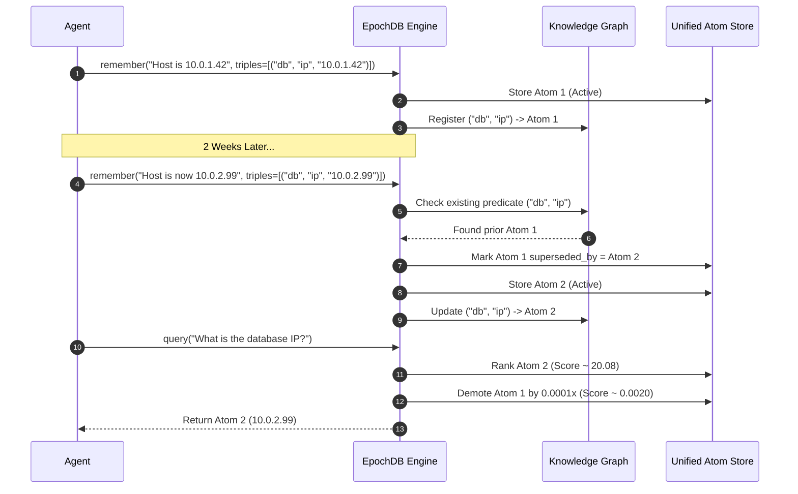

# Atomic State & Supersession

In long-running agent workflows, facts evolve over time. Standard vector stores treat all text as timeless facts, leading to severe hallucination risks when user preferences, system configurations, or environmental states change.

EpochDB implements **Atomic State Management** with **State-Aware Supersession** to resolve contradictions deterministically while maintaining an immutable historical audit trail.

---

## The Problem: Fact Invalidation

Consider an agent managing server deployments:

1. **Day 1**: *"Database host is configured at 10.0.1.42."*
2. **Day 14**: *"Database migrated. Primary host is now 10.0.2.99."*

When the agent later queries: *"What is the primary database IP?"*, standard semantic similarity will retrieve both sentences. Because both sentences are equally relevant in embedding space, the LLM will either guess, combine the two into an invalid IP, or output the older address.

---

## How Supersession Works

EpochDB tracks state mutations through typed Knowledge Graph triples: `(Subject, Predicate, Object)`.



### 1. Subject-Predicate Keying
Each relational triple has a Subject and a Predicate (e.g. `subject="user"`, `predicate="lives_in"`). When a new atom is committed with the same Subject-Predicate pair, EpochDB links the older atom to the new atom via `superseded_by = new_atom_id`.

### 2. Multiplicative Demotion (`0.0001x`)
Rather than physically deleting the historical atom (which would destroy audit logs and point-in-time replays), EpochDB applies a **`0.0001x` penalty** during Stage 5 of retrieval:
- The active atom receives a normal high ranking (or Topic Lock boost).
- The superseded atom's score is crushed by four orders of magnitude, effectively dropping it below any threshold.
- If an agent explicitly queries historical states (e.g., *"Where did the user live previously?"* or specifies a historical timestamp), EpochDB inspects the supersession lineage to trace the historical progression.

---

## Code Example: Verifying Supersession

```python
from epochdb import EpochDB

with EpochDB(storage_dir="./supersession_demo") as db:
    # 1. Record original state
    m1 = db.remember(
        "Production environment runs Python 3.10.",
        metadata={"triples": [("production", "python_version", "3.10")]}
    )

    # Query before update
    hits = db.query("What python version is running in production?", k=1)
    print("Initial:", hits[0].text)
    # Output: "Production environment runs Python 3.10."

    # 2. Record upgrade
    m2 = db.remember(
        "Upgraded production environment to Python 3.12.",
        metadata={"triples": [("production", "python_version", "3.12")]}
    )

    # 3. Query after update
    hits = db.query("What python version is running in production?", k=2)
    print("Updated:", hits[0].text)
    # Output: "Upgraded production environment to Python 3.12."
    
    # Notice that the old atom is still in the database, but demoted:
    print(f"Active atom score: {hits[0].score:.4f}")
    if len(hits) > 1:
        print(f"Stale atom score: {hits[1].score:.6f}")
```

---

## Topic Lock Boost (`+20.0`) & Signal-to-Noise Demotion (`1e-7`)

### The `+20.0` Boost
When an atom matches the verified entity and predicate of the user query, it is awarded an additive **`+20.0` boost**. Since the theoretical maximum of standard 4-way RRF scores caps at $\approx 0.12$, this guarantees that the target fact will always sit at rank 1, immune to semantic noise or superficial phrase similarity.

### The `1e-7` Distractor Demotion
Once a Topic Lock is confirmed, other candidates that do not belong to the topic have their relevance attenuated by $10^{-7}$. This acts as an automated "noise gate" ensuring the prompt sent to the LLM contains only clean, verified facts.
