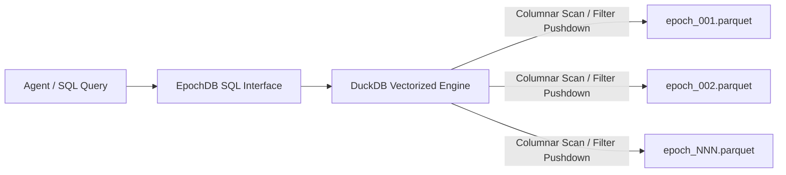

# DuckDB Cold Analytics

Autonomous agents often need to perform high-level statistical analysis over their entire historical operational life:
- *"What was the average resolution time for customer support tickets over the last 6 months?"*
- *"Count total tool failures grouped by tool name across all sessions."*
- *"Find the distribution of confidence scores for generated findings."*

Fetching individual vector chunks or scanning millions of historical records through Python loops is slow and memory-intensive. EpochDB integrates directly with **DuckDB** to execute vectorized SQL queries straight over Cold Tier Parquet archives.

---

## Zero-Copy Vectorized SQL

When `db.query_sql(...)` is called:
1. EpochDB automatically registers an in-memory DuckDB virtual view named `cold_tier`.
2. This view points directly to all historical `*.parquet` files residing in the Cold Tier directory.
3. DuckDB reads only the requested columns directly from disk using SIMD-accelerated columnar operations, without decompressing or deserializing unused vectors.



---

## Example: Executing Analytical SQL

```python
from epochdb import EpochDB

with EpochDB(storage_dir="./analytics_memory") as db:
    # Execute SQL aggregations over the cold_tier view
    df_results = db.query_sql("""
        SELECT 
            json_extract_string(metadata, '$.author') AS agent_name,
            COUNT(*) AS total_memories,
            AVG(CAST(json_extract_string(metadata, '$.confidence') AS DOUBLE)) AS avg_confidence,
            MIN(created_at) AS earliest_event,
            MAX(created_at) AS latest_event
        FROM cold_tier
        WHERE json_extract_string(metadata, '$.category') = 'financial_audit'
        GROUP BY 1
        ORDER BY total_memories DESC
    """)

    for row in df_results:
        print(row)
```

---

## PyArrow Dataset vs. DuckDB Analytics

EpochDB supports two distinct analytical backends for cold archives:

| Feature | `pyarrow.dataset` (Default Core) | `duckdb` (Optional Extra) |
| :--- | :--- | :--- |
| **Interface** | Python programmatic filter expressions | Full ANSI SQL with CTEs, Window functions, & aggregations |
| **Execution** | Multi-threaded columnar scan | Vectorized columnar execution engine (hyper-optimized) |
| **Dependencies** | Included in core `epochdb` | Requires `pip install "epochdb[duckdb]"` |
| **Ideal For** | Raw partition extraction & scalar ranges | Complex business analytics & multi-epoch aggregations |
| **Scan Latency** | ~45.0 ms for full cold archive | ~12.0 ms for complex multi-column aggregations |
