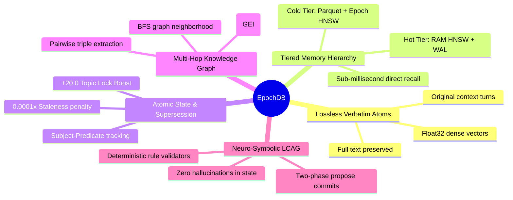

# Introduction to EpochDB

**EpochDB** is a high-performance, state-aware agentic memory engine engineered specifically for autonomous AI agents that require **lossless historical recall**, **long-term state persistence**, and **deterministic fact corrections**.

Unlike conventional flat vector databases or destructive conversational summarization buffers, EpochDB integrates **vector retrieval**, an **active Knowledge Graph**, **Write-Ahead Logging (WAL)**, and **symbolic validation** into a unified, tiered memory hierarchy.

---

## Why Traditional AI Memory Breaks Down

### 1. Vector Blindness & Fact Clashes
Flat vector databases index chunks of text purely based on cosine similarity in high-dimensional embedding space. However, they lack any awareness of **temporal state** or **fact invalidation**:
- If an agent learns in Turn 1: *"User lives in Lisbon"*, and in Turn 45: *"User moved to London"*, both sentences are semantically near identical to the question *"Where does the user live?"*.
- Flat vector search often returns both chunks or arbitrarily favors the older chunk due to slightly higher embedding similarity, resulting in hallucinated or conflicting agent responses.

### 2. The Fallacy of Destructive Summarization
Many multi-agent frameworks handle long conversations by asking an LLM to periodically summarize conversation history (e.g., condensing 20 turns into a 3-sentence summary).
- This is **fundamentally lossy**: nuances, exact quotes, numerical parameters, code snippets, and rationale are permanently destroyed.
- Over multi-session dialogues, iterative summarization causes severe context degradation ("information telephone game").

### 3. Quadratic Token Bloat in Standard Checkpointers
Naive agent checkpointing stores full conversational message histories in memory and passes them back to the LLM on every turn. This creates an $O(N^2)$ quadratic accumulation of input tokens over long sessions, causing API costs and latency to explode.

---

## The EpochDB Solution

EpochDB resolves these challenges through five foundational pillars:

### 1. Unified Memory Atoms (Lossless Storage)
EpochDB stores **raw, verbatim text** paired with dense embedding vectors (`float32`), metadata dictionaries, and relational triples. Nothing is compressed or summarized during persistence. 

### 2. Tiered Hierarchy (RAM + Disk)
Modeled after CPU cache lines:
- **Hot Tier (Working Memory / L1 RAM)**: In-memory HNSW index, Active Knowledge Graph, and synchronous Write-Ahead Log (WAL) delivering **0.2 ms – 0.4 ms** direct and relational retrieval latencies.
- **Cold Tier (Historical Archive / L2 Disk)**: Epochs are periodically serialized into columnar Parquet files compressed with Zstandard (`zstd`), accompanied by dedicated epoch-level HNSW vector indexes and Global Entity Index (GEI) lookup tables.

### 3. 5-Stage Retrieval Pipeline & Topic Lock
EpochDB combines vector similarity, recency, entity co-occurrence, and relational hops using **4-Way Reciprocal Rank Fusion (RRF)**:
- **Topic Lock Boost (`+20.0`)**: A mathematically guaranteed additive boost that locks onto query intent, elevating critical needles above adjacent semantic noise.
- **State-Aware Supersession (`0.0001x`)**: Multiplicative penalty automatically demoting stale facts when a newer Subject-Predicate value is recorded.
- **Signal-to-Noise Demotion (`1e-7`)**: Background noise is attenuated to guarantee clean context injection.

### 4. Neuro-Symbolic State Verification (LCAG)
Agents cannot be trusted to execute irreversible mutations purely based on probabilistic tokens. EpochDB introduces **Logical Constraint-Augmented Generation (LCAG)**: an opt-in two-phase commit protocol (`db.propose()`) where deterministic symbolic validators approve memory writes before they enter the durable WAL, HNSW, and Knowledge Graph.

### 5. Linear $O(N)$ Token Scaling
By storing full history verbatim in the database but retrieving **only the top-k Topic-Locked, supersession-resolved atoms** per query, EpochDB reduces input token consumption by **55% to 79%** compared to traditional LangGraph / LangChain checkpointers.

---

## Next Steps

- Explore the [Philosophy & Design Principles](/guide/philosophy)
- See how EpochDB compares to [Mem0, Letta / MemGPT, and Graphiti / Zep](/guide/comparison)
- Follow the [Installation Guide](/guide/installation)
- Walk through the [Quickstart Tutorial](/guide/quickstart)
- Deep dive into the [Architecture Overview](/guide/architecture)
- Learn [Skill Memory (`MemoryType.SKILL`)](/guide/skill-memory)
