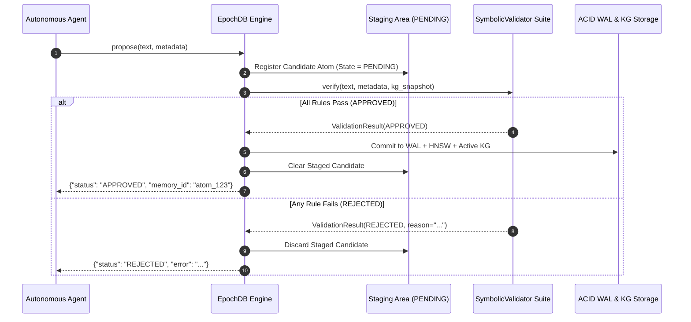

# Neuro-Symbolic State Verification (LCAG)

Language models are fundamentally probabilistic: they generate plausible token sequences based on distributional statistics. When an AI agent is empowered to mutate persistent databases, grant credentials, update system policies, or balance financial portfolios, **probabilistic writes create unacceptable operational risk**.

EpochDB introduces **Logical Constraint-Augmented Generation (LCAG)**: an opt-in, two-phase state verification mechanism that prevents LLM hallucinations from corrupting durable database state.

---

## The Two-Phase Commit Architecture



### Opt-In Design
- `db.remember()` remains the **zero-overhead default**. If you do not specify validators, `remember()` writes directly to the WAL and HNSW index.
- Pass `validators=[...]` to `EpochDB(...)` and call `db.propose()` when you want deterministic guardrails.

---

## Writing Custom Symbolic Validators

To create a validator, subclass `SymbolicValidator` and implement the `verify` method:

```python
from epochdb import (
    EpochDB,
    SymbolicValidator,
    ValidationResult,
    ValidationStatus,
)

class EnforceAccessControl(SymbolicValidator):
    """Rejects state writes to restricted infrastructure unless authorized."""
    
    def verify(self, text: str, metadata: dict, kg_snapshot: dict) -> ValidationResult:
        meta = metadata or {}
        
        # Check security clearance tag
        if "delete" in text.lower() or "drop" in text.lower():
            if meta.get("role") != "superadmin":
                return ValidationResult(
                    status=ValidationStatus.REJECTED,
                    reason="Destructive operations require superadmin authorization."
                )

        # Inspect immutable snapshot of existing Knowledge Graph state
        entities = kg_snapshot.get("entities", set())
        if "Production Database" in entities and meta.get("environment") == "staging":
            return ValidationResult(
                status=ValidationStatus.REJECTED,
                reason="Staging agents cannot modify Production Database entity state."
            )

        return ValidationResult(ValidationStatus.APPROVED)
```

---

## Complete Example: Guarded State Mutation

```python
from epochdb import EpochDB

validators = [EnforceAccessControl()]

with EpochDB(storage_dir="./secure_memory", validators=validators) as db:
    # 1. Proposal with insufficient permissions -> REJECTED
    res1 = db.propose(
        "Drop table user_sessions;",
        metadata={"role": "analyst", "environment": "production"}
    )
    print("Proposal 1 Result:", res1)
    # Output: {'status': 'REJECTED', 'error': 'Destructive operations require superadmin authorization.'}

    # 2. Proposal with valid permissions -> APPROVED
    res2 = db.propose(
        "Drop table user_sessions;",
        metadata={"role": "superadmin", "environment": "production"}
    )
    print("Proposal 2 Result:", res2)
    # Output: {'status': 'APPROVED', 'memory_id': 'atom_01J...'}

    # 3. Informational writes that don't alter state can still use remember()
    db.remember("Analyst ran diagnostic check.")
```

---

## What is Inside `kg_snapshot`?

When `verify()` is called, EpochDB provides an immutable dictionary snapshot containing:
- `entities`: Set of all active entity names registered in the Knowledge Graph.
- `predicates`: Dictionary mapping active `(subject, predicate)` pairs to current atom IDs.
- `epoch_id`: Current active epoch identifier.
- `hot_atom_ids`: Set of all active atoms currently in working memory.
- `pending_ids`: Set of other candidate atoms currently in the staging queue.

This enables you to write deterministic mathematical or symbolic rule engines (including **Z3 theorem prover** SMT logic, schema type validators, or role-based access controllers) that inspect both the incoming write and the current world state before anything is made permanent.
