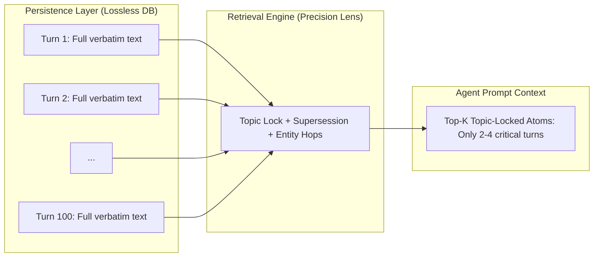

# Philosophy & Design Principles

At the core of EpochDB is a refusal to accept the compromises standard vector stores and summarization buffers force on modern AI systems. This page details the design principles and mathematical reasoning behind EpochDB.

---

## 1. Verbatim Fidelity vs. Destructive Summarization

Many agent memory architectures rely on LLM prompts to continuously rewrite and condense historical context:

```
Raw Conversation:
"We are migrating from PostgreSQL to SQLite for edge devices, 
but we need WAL mode enabled and busy_timeout set to 5000ms 
because high concurrent read-locks were failing in staging."
                   │
                   ▼ (LLM Summarization)
"User prefers SQLite with WAL."   <-- CRITICAL CONSTRAINTS DESTROYED
```

When an agent needs to debug a staging failure 3 weeks later, the exact timeout settings and rationale are gone.

### The EpochDB Rule: Never Mutate History Destructively
EpochDB treats historical records as **immutable, high-fidelity atoms**:
1. Every input is preserved **verbatim** in persistent storage (Parquet files with float32 vectors).
2. Nuances, code parameters, timestamps, and authorship remain 100% intact.
3. Instead of compressing the *database*, EpochDB optimizes the *retrieval lens*.

---

## 2. Reconciling Lossless DB with Linear $O(N)$ Token Context

A common objection is: *"If you store everything verbatim, won't agent prompts explode with tokens?"*

EpochDB decouples the **Persistence Layer** from the **Prompt Context Window**:



- **Traditional Checkpointer (e.g. MemorySaver)**: Dumps all past turns into the system prompt. In turn 50, you pay for turns 1 through 49 ($O(N^2)$ cumulative cost).
- **EpochDB**: Stores millions of atoms across Hot and Cold tiers, but retrieves only the top-$k$ relevant, Topic-Locked, supersession-resolved atoms for the active turn. The context payload remains flat and linear ($O(N)$), saving **55% to 79%** of input tokens.

---

## 3. Mathematical Foundations of Retrieval Constants

The constants used in EpochDB's 5-stage retrieval pipeline are derived from mathematical bounds rather than arbitrary empirical tuning.

### The RRF Upper Bound
In Reciprocal Rank Fusion (RRF) with the standard parameter $K = 60$, an atom's score across $M$ ranking dimensions (Semantic, Recency, Entity overlap, Quantitative) is given by:

$$\text{RRF Score} = \sum_{i=1}^{M} \frac{w_i}{K + \text{rank}_i}$$

With typical weights ($w_{\text{semantic}}=3, w_{\text{recency}}=1, w_{\text{entity}}=1, w_{\text{quant}}=2$) and ideal rank 1 across all signals:

$$\text{Max Score} = \frac{3}{61} + \frac{1}{61} + \frac{1}{61} + \frac{2}{61} \approx 0.1148$$

### The `+20.0` Topic Lock Boost
Because the maximum possible RRF score sum is strictly bounded below $\approx 0.12$, an additive boost of **`+20.0`** acts as a **mathematical hard lock**:
- An atom whose entity and predicate match the verified query intent is guaranteed to score $> 20.0$.
- Any background distractors, even those with perfect semantic similarity across multiple vectors, cannot exceed $\approx 0.12$.
- This completely prevents false positive drift and "needle-in-a-haystack" degradation.

### The `0.0001x` Supersession Demotion
When an agent observes an updated value for an existing `(subject, predicate)` pair (e.g., `(user, employer, VectorAI)` superseding `(user, employer, OldCorp)`):
- The outdated atom's score is multiplied by **`0.0001`**.
- Even if the older atom had a perfect score of $20.1$, its superseded score becomes $0.00201$, sinking far below any current relevant candidate.
- The historical atom remains safely recorded in the database for auditing and historical analysis, but disappears from the immediate agent's focus.

### The `1e-7` Signal-to-Noise Demotion
When Topic-Locked entities are confirmed in the query, unrelated candidate atoms in the candidate pool are scaled down by $10^{-7}$. This suppresses background chatter and preserves precious context space.

---

## 4. Tiered Hierarchy Inspired by CPU Caching

EpochDB explicitly adopts the L1 / L2 caching paradigm:

| CPU Architecture | EpochDB Component | Storage Medium | Access Latency | Role |
| :--- | :--- | :--- | :--- | :--- |
| **L1 Data Cache** | **Hot Tier** | RAM + HNSW | **0.2 – 0.4 ms** | Active conversational session & recent facts |
| **L2 Unified Cache** | **Cold Tier** | NVMe / SSD Parquet + HNSW | **~4.0 ms** | Long-term memory across historical epochs |
| **Main Memory / Disk** | **Cold Scan (DuckDB)** | Columnar Parquet | **~45 ms** | Cross-epoch analytical aggregations |
| **Non-Volatile Log** | **WAL (Write-Ahead Log)**| Direct I/O / io_uring | **< 1 ms** | ACID crash resilience and zero data loss |

---

## 5. Truth-Native AI & Neuro-Symbolic Gating

Probabilistic language models generate plausible tokens, but they cannot guarantee factual consistency or enforce business rules.

EpochDB embraces a **Truth-Native** paradigm:
- **Symbolic Grounding**: Facts are extracted as typed Knowledge Graph triples `(Subject, Predicate, Object)`.
- **Validation Before Mutation**: The `propose()` interface gives deterministic Python rules or SMT solvers the power of veto over agent memory state changes.
- **Auditable Lineage**: Every mutation can be tied back to its source, the triggering agent, and the operational rationale.
