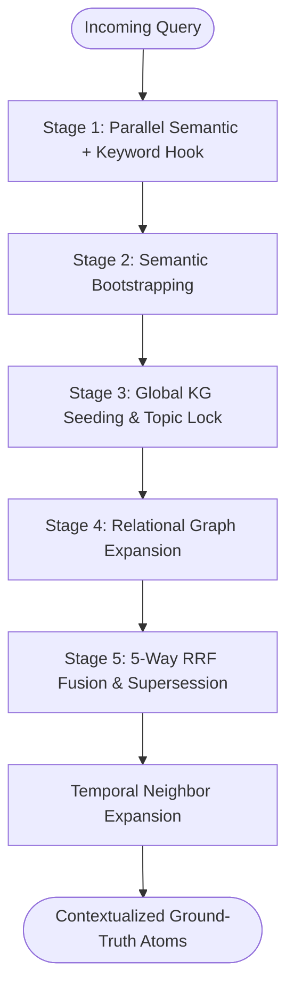

# The Retrieval Pipeline

EpochDB's retrieval engine is engineered to solve two notorious failure modes in traditional RAG:
1. **Multi-Hop Vector Blindness**: Inability to connect logically related facts separated across multiple documents or conversation turns.
2. **Hallucinated Temporal Contradictions**: Returning obsolete facts instead of current ground truth.

To overcome these, EpochDB executes a multi-stage retrieval pipeline combining dense vector search, **keyword / BM25 matching**, relational graph exploration, deterministic topic locking, and reciprocal rank fusion.

---

## Retrieval Pipeline Architecture



---

## The Stages Explained

### Stage 1: Parallel Semantic + Keyword Hook
The query string is embedded into a dense vector (either locally via `SentenceTransformers` or through remote embedding APIs like Gemini or OpenAI).

EpochDB issues concurrent queries to:
- The **Hot Tier HNSW** in RAM.
- The **Hot Tier KeywordIndex** (BM25 over atom text).
- The **Probed Cold Tier Epoch Indexes** on disk (selected via recency, GEI matches, and epoch centroid proximity).
- **Lexical cold scans** over the same probed epochs for exact-token / substring overlap.

An oversampled candidate pool ($10 \times k$) is collected across both tiers to ensure deep recall. The keyword channel is especially useful for IDs, error codes, and exact names that embeddings often miss.

---

### Stage 2: Semantic Bootstrapping
What if the user's query does not explicitly specify entities? (e.g., *"What were the project risks mentioned during the review?"* instead of naming the project directly).

EpochDB inspects the top semantic vector hits from Stage 1:
- Any entities associated with hits exceeding a cosine similarity threshold of **`0.5`** are automatically extracted.
- These discovered entities are fed into the next stage, allowing pure semantic queries to **"bootstrap"** their way into structured Knowledge Graph traversal.

---

### Stage 3: Global KG Seeding (Topic Lock)
Once query entities are identified (either explicitly provided or bootstrapped in Stage 2), EpochDB pulls **all memory atoms** linked to these entities from the Global Entity Index (GEI).

- This guarantees that even semantically distant facts (e.g. an obscure setting or password mentioned 50 turns earlier) are injected into the candidate pool.
- In Needle-In-A-Haystack (NIAH) benchmarks, this ensures that the "needle" is never missed simply because its semantic embedding differs from the phrasing of the question.

---

### Stage 4: Relational Expansion (Multi-Hop)
For each atom in the candidate pool, the engine traverses the Active Knowledge Graph and persistent SQLite graph edges up to $N$ hops (controlled by `expand_hops`, default `2`).

```
Query: "Who manages the platform developed by VectorAI?"
Candidate Hit: (VectorAI, develops, CRISPR-X)
1-Hop Traversal: (CRISPR-X, managed_by, Dr. Sarah Lin)
2-Hop Traversal: (Dr. Sarah Lin, reports_to, VP of Engineering)
```

By adding these multi-hop neighboring atoms into the evaluation pool, EpochDB bridges inductive gaps that flat vector search cannot traverse.

---

### Stage 5: 5-Way RRF Fusion & Supersession
This stage evaluates and ranks all candidates across five distinct mathematical signals using **Reciprocal Rank Fusion (RRF)**:

| Ranking Signal | Weight | Mechanism | Description |
| :--- | :---: | :--- | :--- |
| **Semantic** | 3.0 | RRF Rank ($K=60$) | Proximity in embedding space. |
| **Keyword** | 1.5 | BM25 / lexical overlap | Exact tokens, IDs, and phrase hits. |
| **Recency** | 1.0 | Monotonic Order | Monotonically increasing epoch timestamps. |
| **Entities** | 1.0 | Overlap Count | Density of entity intersections with the query. |
| **Quantitative** | 2.0 | Intent match | Scalar / series alignment with numeric query intent. |
| **Topic Lock** | Additive | **`+20.0` Boost** | Nuclear additive bonus for atoms matching verified query intent. |

#### Supersession & Noise Demotion
- **State-Aware Supersession (`0.0001x`)**: If an atom represents an outdated Subject-Predicate pair that has since been overwritten by a newer atom, its score is multiplied by `0.0001x`. This mathematically demotes it to the bottom of the pool without deleting it from historical memory.
- **Signal-to-Noise Demotion (`1e-7`)**: If a confirmed Topic-Locked fact is present, all non-locked distractor atoms are demoted by $10^{-7}$, keeping the agent's prompt context clean and focused.

---

## Contextualized Retrieval (Temporal Neighbor Expansion)

In conversational interactions, a single memory sentence often requires the surrounding context to make sense:

```
Turn 12: "We encountered error code 503 on the auth gateway."
Turn 13: "Restarting Redis resolved the issue."  <-- MATCHED ATOM
Turn 14: "Logs confirmed no token leaks occurred."
```

If the agent only retrieves Turn 13, it doesn't know *what* was resolved. 

EpochDB supports **Temporal Neighbor Expansion** (`expand_context=True` or `temporal_window=1`):
- For every top-$k$ atom selected by Stage 5, EpochDB fetches the preceding and subsequent chronologically adjacent atoms from the same session/thread.
- The agent receives the focal fact embedded within its natural conversational flow.
