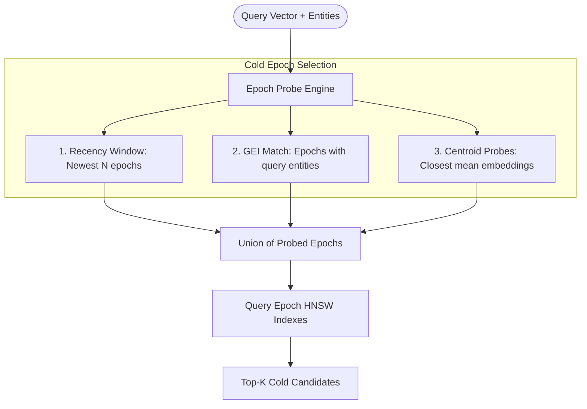

# Tiered Storage (Hot & Cold Tiers)

A central challenge in agentic memory is handling scale without sacrificing latency. Autonomous agents continuously generate state: conversation turns, tool outputs, scraped web pages, and decision logs. Keeping millions of high-dimensional vectors in active RAM is cost-prohibitive, but scanning multi-gigabyte disk databases on every turn ruins real-time agent responsiveness.

EpochDB solves this through its **Two-Tier Caching Architecture**.

---

## The Hot Tier (L1 Working Memory)

The **Hot Tier** resides entirely in system RAM and serves as the agent's immediate working memory:

- **Sub-millisecond Latency**: Direct atom lookups and HNSW approximate nearest-neighbor vector queries complete in **0.2 ms – 0.4 ms**.
- **In-Memory HNSW Index**: Vectors are indexed via `hnswlib` with Euclidean or Cosine distance metrics.
- **Active Knowledge Graph**: Real-time adjacency graph holding entity-to-atom bindings and active relational edges.
- **Write-Ahead Log (WAL)**: Ensures zero data loss. Before an atom is committed to RAM, its serialized payload is appended and flushed to the WAL file on disk.

### Hot Tier Crash Recovery
If the process terminates unexpectedly:
1. On re-opening, EpochDB reads the active WAL file sequentially.
2. Every atom is re-inserted into the in-memory store, HNSW index, and Active KG.
3. Cold-tier Parquet files already written are untouched.
4. Recovery completes in **9.1 ms** (benchmarked over 10,000 in-flight atoms).

---

## The Cold Tier (L2 Historical Archive)

When an epoch reaches its duration limit (configured by `epoch_duration_secs`, defaulting to 3600 seconds) or when `db.flush()` is called:
1. Active Hot Tier atoms are serialized into **Apache Parquet** format.
2. Vector embeddings are stored as native **Float32 arrays** to preserve 100% precision without quantization artifacts.
3. The file is compressed using **Zstandard (`zstd` level 3)**, yielding high compression ratios and ultra-fast decompression.
4. An accompanying **`.hnsw` index** is serialized alongside the Parquet file, enabling vector search on disk without loading entire datasets into memory.
5. The **Global Entity Index (GEI)** and **Epoch Centroid** (mean embedding vector) are updated.

---

## Probed vs. Exhaustive Cold Search

In early vector databases, querying historical disk archives required searching every single partition on disk (broadcast scan), which scales linearly as $O(E)$ with the number of epochs.

EpochDB introduces **Probed Cold Retrieval** (`cold_search_mode="probe"`):

### 1. Recency Window (`recency_epochs`)
The engine always inspects the most recent $N$ epochs by file modification time. This guarantees that recent context and working memory remain immediately accessible.

### 2. Global Entity Index Match (GEI)
If the query mentions entities (e.g. `"NeuroLink Corp"`), the GEI immediately returns the exact epoch IDs where this entity has appeared across historical sessions.

### 3. Centroid Cosine Probes (`centroid_probes`)
Each epoch on disk stores a precomputed centroid vector (the average vector of all atoms within that epoch). The probe engine calculates cosine similarity between the query embedding and each epoch centroid, opening only the top-$K$ geometrically closest epochs.

### 4. Automatic Exhaustive Fallback
If the total number of epochs in storage is smaller than `recency_epochs + centroid_probes`, EpochDB automatically searches all epochs. Pass `cold_search_mode="exhaustive"` to force an exhaustive scan.

---

## Space Compaction & Deduplication

Over extended agent deployments, deleted memories and superseded facts accumulate on disk. Calling `db.compact()`:
- Scans Cold Tier Parquet archives.
- Removes soft-deleted atoms.
- Re-indexes the remaining atoms into consolidated Parquet files and refreshed HNSW structures.
- Frees disk space and optimizes query read paths.
