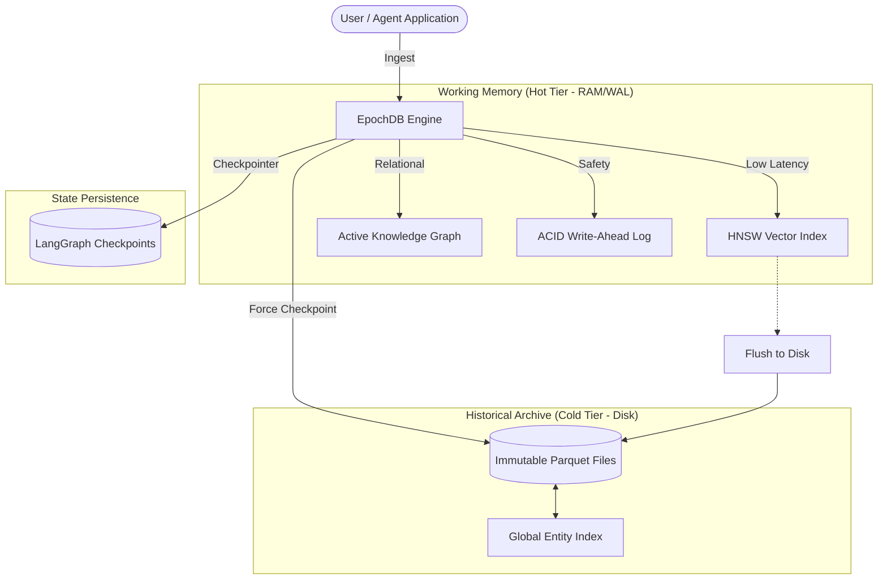
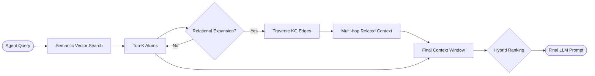

# EpochDB: Architecture & Concepts / Arquitetura e Conceitos

# How EpochDB Works

EpochDB is an **Agentic Memory Engine** that treats long-term memory as a tiered hierarchy. It moves beyond simple "flat" vector stores by integrating relational reasoning directly into the persistence layer.

## Visual Architecture

### 1. The Tiered Persistence Lifecycle
EpochDB manages the lifecycle of "Memory Atoms" through a Hot/Cold tiering strategy, ensuring sub-millisecond access to recent context while Archiving history in space-efficient Parquet files.

### 2. The Reasoning Retrieval Flow
Retrieval in EpochDB is a multi-stage process that combines semantic relevance with relational context to bridge logical gaps.

---

## Technical Components

## 🇺🇸 English: How It Works

### 1. The Core Philosophy: Lossless Verbatim Storage
Most traditional AI memory systems use an LLM to automatically compress and summarize conversations (e.g., rewriting "I'm migrating from MySQL to PostgreSQL for better JSON support" into "Likes PostgreSQL"). This process is fundamentally destructive. Context, nuances, and explicit trade-offs are permanently lost.

**EpochDB** bypasses this by storing "Unified Memory Atoms"—the raw, verbatim text paired directly with a dense embedding—ensuring zero data degradation. 

### 2. The Tiered Architecture
To manage massive amounts of text natively without overwhelming hardware, EpochDB utilizes a dual-tier storage strategy similar to CPU caching:

* **L1: Working Memory (The Hot Tier)**
  Recent interactions are stored entirely in RAM. It utilizes an `HNSW` (Hierarchical Navigable Small World) vector index alongside an active metadata dictionary. This allows the agent to perform sub-millisecond similarity searches against ongoing conversation contexts.

* **L2: Historical Archive (The Cold Tier)**
  Because RAM is finite, EpochDB implements "Epoch Checkpoints." Periodically, older memories are evicted from RAM and serialised to disk using `PyArrow` via **Asynchronous Daemon Threads**. This ensures that high-volume ingestion never blocks the main agent execution loop. Memories are quantized via *int8 scalar quantization* (4x reduction) and compressed using **Zstandard (Zstd)** before being written into immutable `.parquet` files. This dual-engine approach ensures the engine remains lightweight while retaining access to unlimited historical data.

### 3. Solving Multi-Hop Retrieval: The Global Entity Index
The primary challenge of partitioning memory files by time is that connections are severed. If a user defines "Project X" in January (Epoch 1) and praises "Project X" in May (Epoch 40), a standard vector database might fail to connect the two isolated files.

EpochDB solves this via the **Global Entity Index**. 
Regardless of which Parquet file a memory atom gets flushed to, its semantic entities (Subjects and Objects) are indexed in a master dictionary that persists in memory (`Global KG`). 
When an agent querying the database hits a node, the Retriever executes a **Recursive Reflection**: it extracts the entities, looks them up in the Global Index, and precisely loads the historical Parquet blocks necessary to traverse the graph over time. This enables complex, multi-hop reasoning across disconnected sessions.

---

## 🇧🇷 Português: Como Funciona

### 1. A Filosofia Central: Armazenamento Literal Sem Perdas
A maioria dos sistemas tradicionais de memória para IA utiliza um LLM para comprimir e resumir conversas automaticamente (por exemplo, reescrevendo "Estou migrando de MySQL para PostgreSQL por causa do suporte a JSON" para apenas "Gosta de PostgreSQL"). Esse processo é fundamentalmente destrutivo, fazendo com que contexto, nuances e detalhes explícitos sejam perdidos permanentemente.

O **EpochDB** evita isso armazenando "Unified Memory Atoms" (Átomos de Memória Unificados) — que contêm o texto cru e literal, associado diretamente ao seu `dense embedding` (vetor denso) — garantindo degradação zero dos dados.

### 2. A Arquitetura em Camadas
Para gerenciar quantidades massivas de texto sem sobrecarregar o hardware, o EpochDB utiliza uma estratégia de armazenamento em duas camadas, semelhante ao cache de uma CPU:

* **L1: Memória de Trabalho (Camada Quente / Hot Tier)**
  Interações recentes são armazenadas inteiramente na memória RAM (in-memory). Esta camada utiliza um índice vetorial `HNSW` junto com um dicionário ativo de metadados. Isso permite que o agente faça buscas por similaridade em sub-milissegundos referentes ao contexto da conversa em andamento.

* **L2: Arquivo Histórico (Camada Fria / Cold Tier)**
  Como a RAM é finita, o EpochDB implementa "Epoch Checkpoints" (Pontos de Verificação de Épocas). Periodicamente, as memórias mais antigas são removidas da RAM e serializadas no disco utilizando `PyArrow` através de **Threads Assíncronas (Daemon Threads)**. Isso garante que a ingestão de alto volume nunca bloqueie o loop de execução do agente. As memórias são comprimidas via *quantização escalar int8* (reduzindo o espaço em 4x) e codificadas com **Zstandard (Zstd)** antes de serem gravadas em arquivos `.parquet` imutáveis. Essa abordagem de compressão dupla garante que o motor continue leve, mantendo acesso ilimitado ao histórico.

### 3. Resolvendo a Busca "Multi-Hop": O Índice Global de Entidades
O principal desafio de particionar arquivos de memória por tempo é que conexões podem ser cortadas. Se um usuário descreve o "Projeto X" em Janeiro (Época 1) e elogia o "Projeto X" em Maio (Época 40), um banco de dados vetorial comum pode falhar em conectar as duas informações isoladas.

O EpochDB resolve isso através do **Índice Global de Entidades (Global Entity Index)**.
Independentemente de qual arquivo Parquet o átomo de memória for gravado, suas entidades semânticas (Sujeitos e Objetos) são catalogadas em um dicionário mestre que persiste na memória.
Quando um agente realiza uma busca que cruza com um nó relevante, o Retriever executa uma **Reflexão Recursiva / Relational Expansion**: ele extrai as entidades, verifica o Índice Global e carrega de forma cirúrgica apenas os blocos históricos no Parquet necessários para atravessar o grafo no tempo. Isso possibilita raciocínio complexo de múltiplos saltos cruzando sessões até então desconectadas.

---

## 4. Ecosystem & Integrations / Ecossistema e Integrações

EpochDB is designed to work seamlessly with modern agent orchestration frameworks, such as **LangGraph**. By defining `retrieve` and `store` nodes as core steps in your agent's graph, EpochDB operates as the permanent context layer, injecting relevant history before LLM generation and archiving interactions afterward. See `benchmark.md` and `example_langgraph.py` for concrete implementation flows.

*O EpochDB é projetado para funcionar perfeitamente com frameworks modernos de orquestração de agentes, como o **LangGraph**. Ao definir os nós de `retrieve` e `store` como etapas centrais no grafo do seu agente, o EpochDB atua como uma camada permanente de contexto, injetando o histórico relevante antes da geração do LLM e arquivando as interações em seguida. Veja `benchmark.md` e `example_langgraph.py` para consultar fluxos concretos de implementação.*

