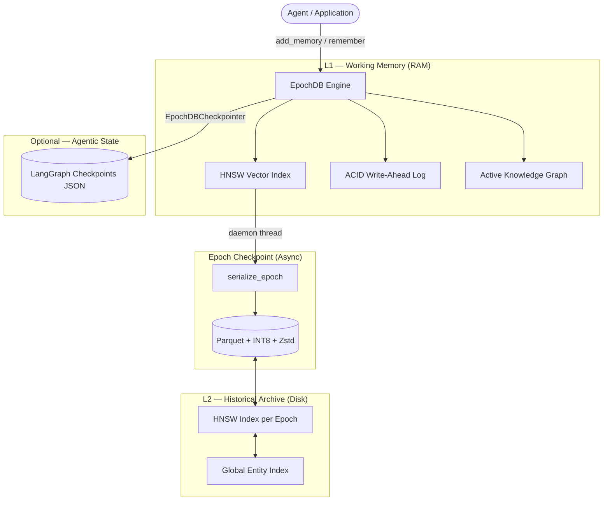

# How EpochDB Works

EpochDB is an **Agentic Memory Engine** that treats long-term memory as a tiered hierarchy, moving far beyond simple flat vector stores by integrating relational reasoning directly into the persistence layer.

---

## 1. Core Philosophy — Lossless Verbatim Storage

Most AI memory systems use an LLM to automatically *compress and summarize* conversations. For example, rewriting:

> *"I'm migrating from MySQL to PostgreSQL specifically for better JSONB indexing performance"*

...into:

> *"Likes PostgreSQL"*

This process is **fundamentally destructive**. Context, nuance, explicit trade-offs, and the rationale that makes a piece of information *useful* are permanently discarded.

**EpochDB bypasses this entirely.** It stores **Unified Memory Atoms** — the raw, verbatim text paired directly with a dense embedding vector. Retrieval operates on the original source material, never on a lossy approximation.

---

## 2. The Tiered Architecture

To manage large amounts of text without overwhelming hardware, EpochDB uses a two-tier strategy modelled after CPU cache hierarchy.



### L1 — Hot Tier (Working Memory)

Recent memories live entirely in RAM:

- **HNSW Vector Index** (`hnswlib`): Hierarchical Navigable Small World graph enables approximate nearest-neighbour lookup in sub-millisecond time. The index auto-resizes when it approaches capacity.
- **ACID Write-Ahead Log**: Every `add_memory` call is first appended to a `wal.jsonl` file on disk and `fsync`'d before the in-memory write. On the next startup, any `ADD` records not followed by a `COMMIT` are replayed into the Hot Tier, providing genuine crash recovery.
- **Active Knowledge Graph**: A live in-memory dict maps entity strings to `[atom_id, epoch_id]` pairs, enabling relational lookup without loading any Parquet files.

### L2 — Cold Tier (Historical Archive)

Every epoch is serialized into a immutable Parquet file accompanied by a **Persistent HNSW Index** (`.hnsw`).

1. The Hot Tier is cleared immediately, so the agent continues uninterrupted.
2. A daemon thread serializes the epoch's atoms to a `.parquet` file.
3. A corresponding HNSW index is built for the epoch's embeddings and saved to disk.
4. The WAL is cleared **only after** both the Parquet and HNSW writes succeed.

This tiered indexing allows EpochDB to scale to millions of atoms across hundreds of epochs without $O(N)$ linear scan penalties.

Each Cold Tier file uses two compression layers:

| Layer | Technique | Effect |
|---|---|---|
| INT8 Scalar Quantization | Per-row max-value scaling, cast to int8 | ~4× embedding footprint reduction |
| Zstandard (Zstd) | Block-level compression | Additional ~2–4× reduction on quantized data |

Dequantization is transparent on load: `emb_f32 = (emb_i8 / 127.0) * row_max`.

---

## 3. Write Path — From Atom to Disk

```
add_memory(payload, embedding, triples)
    │
    ├─ [1] WAL.append("ADD", atom.to_dict())   ← fsync to disk
    │
    ├─ [2] HotTier._add_atom(atom)             ← HNSW + dict
    │
    ├─ [3] WAL.append("COMMIT", {})            ← transaction boundary
    │
    └─ [4] global_kg[entity].append([atom_id, epoch_id])
                                               ← batched to disk every 50 writes
```

The entire write (WAL + HNSW + KG) is wrapped in a `MultiIndexTransaction` context manager. If any step raises, a `ROLLBACK` record is appended and the exception propagates.

---

## 4. Retrieval — 5-Stage Pipeline

```mermaid
graph LR
    Q([Query embedding]) --> S1[Hot Tier HNSW\ntop_k × 10 candidates]
    Q --> S1a[Global KG Entity Hook\nSeed candidates from query_entities]
    Q --> S2[Cold Tier brute-force\ntop_k × 10 per epoch]

    S1 & S1a & S2 --> C[Candidate Pool]

    C --> E{expand_hops > 0?}
    E -->|Yes| KG[Traverse Global KG\nN hops]
    KG --> C

    C --> D[Payload Deduplication]
    D --> R[3-Way RRF Ranking]
━━━━━━━━━━━━━━━━━━━━━━━━━━━━━━━━━━━━━━━━━━━━━━━━━━━━━━━━━━━━━━━━
  Stage 1 & 2 — Parallel Retrieval
━━━━━━━━━━━━━━━━━━━━━━━━━━━━━━━━━━━━━━━━━━━━━━━━━━━━━━━━━━━━━━━━

Both tiers are searched simultaneously:

- **Hot Tier**: `hnswlib.knn_query` returns the most relevant recent hits. We fetch a large pool (`top_k * 10`) to provide surface area for rank fusion.
- **Stage 1a — Entity Hook (Topic Lock Seeding)**: If the user provides explicit `query_entities`, the engine proactively seeds the candidate pool by pulling ALL atoms associated with those entities in the Global KG. This ensures that even semantically distant facts (the "Needle") are always considered if they belong to the requested topic.
- **Cold Tier**: Each epoch's `.hnsw` index is queried (`top_k * 10`). We aggregate candidates from across all historical epochs, bypassing linear Parquet scans.

### Stage 3 — Relational Expansion

For each atom in the candidate pool, its KG triples are extracted to get subject/object entities. The **Global Entity Index** maps those entities to `[atom_id, epoch_id]` pairs, which are then fetched (Hot first, then Cold). This repeats for `expand_hops` iterations, building a graph neighbourhood around the initial semantic hit.

This is what allows EpochDB to answer questions like *"what technology does Jeff's project use?"* even when `Jeff`, `Project X`, and `Parquet` are stored in three different Parquet files across different sessions.

Identical payload strings are deduplicated.

━━━━━━━━━━━━━━━━━━━━━━━━━━━━━━━━━━━━━━━━━━━━━━━━━━━━━━━━━━━━━━━━
  Stage 5 — 4-Way Fusion & Supersession
━━━━━━━━━━━━━━━━━━━━━━━━━━━━━━━━━━━━━━━━━━━━━━━━━━━━━━━━━━━━━━━━

EpochDB uses a customized **Reciprocal Rank Fusion (RRF)** pipeline with an integrated **Topic Lock** and **State Filter**:

| Pillar | Mechanism | Description |
|---|---|---|
| **Semantic** | RRF Rank | Cosine similarity to query |
| **Recency** | RRF Rank | Strictly monotonic engine-assigned timestamps |
| **Entities** | RRF Rank | Overlap with query-extracted entities |
| **Topic Lock** | Additive Bonus & Seeding | **Nuclear Topic Lock**: Architectural seeding of candidates via Entity Hook + discrete `+5.0` bonus for atoms matching the query's predicate domain |
| **Supersession** | Multiplier | Stale factual states are penalized by `0.001x` if a newer fact for the same Subject/Predicate exists |

---

## 5. Crash Recovery

On `EpochDB.__init__`, the WAL is read before any other operation:

```
startup
  │
  ├─ read wal.jsonl
  │    ├─ replay uncommitted ADD records → Hot Tier
  │    └─ restore their entities → Global KG
  │
  └─ clear WAL
```

If a process was killed mid-transaction, the uncommitted atoms are silently restored without any user action. The lock file contains the owning PID; stale locks (dead process) are auto-removed.

---

## 6. LangGraph Integration

EpochDB ships a `EpochDBCheckpointer` — a native `BaseCheckpointSaver` implementation that stores LangGraph thread checkpoints as JSON files inside the same storage directory as the memory atoms.

```
.epochdb_data/
├── metadata.json          ← dimensionality enforcement
├── global_kg.json         ← Global Entity Index
├── wal.jsonl              ← Write-Ahead Log
├── epoch_3f2a1b8c.parquet ← Cold Tier epoch
├── epoch_7e4d9c12.parquet
└── checkpoints/
    └── thread_001/
        ├── cp_abc123.ckpt.json   ← LangGraph state
        └── cp_abc123.<task>.writes.json
```

This means a single `EpochDB` instance provides both long-term associative memory **and** short-term agentic workflow state, sharing one storage directory and one initialization path.

See [`example_langgraph.py`](example_langgraph.py) for a complete multi-session implementation.

---

## 7. Key Configuration Parameters

| Parameter | Default | Description |
|---|---|---|
| `storage_dir` | `./.epochdb_data` | Root directory for all persisted state |
| `dim` | `384` | Embedding dimension (enforced; raises on mismatch) |
| `epoch_duration_secs` | `3600` | Seconds before Hot Tier auto-flushes to Cold |
| `hot_tier_capacity` | `10_000` | Initial HNSW index capacity (auto-resizes) |
| `saliency_threshold` | `0.1` | Minimum cosine similarity for Cold Tier candidates |
| `model` | `None` | Optional `SentenceTransformer` model name for auto-embedding |
