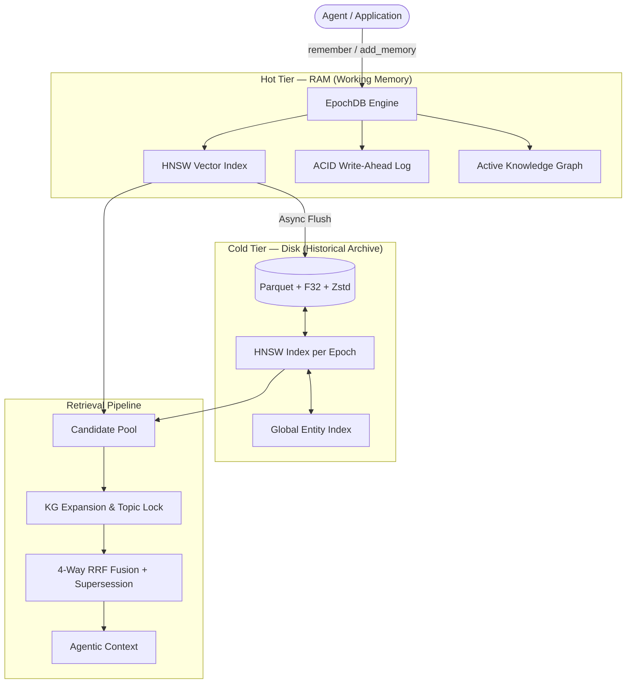

# How EpochDB Works

EpochDB is an **Agentic Memory Engine** that treats long-term memory as a tiered hierarchy. It moves beyond flat vector stores by integrating relational reasoning and atomic state management directly into the persistence layer.

---

## 1. Core Philosophy — Lossless Verbatim Storage

Traditional AI memory systems often use an LLM to *compress and summarize* conversations (e.g., rewriting *"I'm migrating to PostgreSQL for better JSONB performance"* into *"Likes PostgreSQL"*). This process is **fundamentally destructive**; context, nuance, and rationale are permanently discarded.

**EpochDB bypasses this.** It stores **Unified Memory Atoms** — raw, verbatim text paired with high-precision dense embedding vectors. Retrieval operates on original source material, ensuring the agent always has access to the full context.

---

## 2. The Tiered Architecture

EpochDB uses a tiered hierarchy modeled after CPU caches to balance performance and scale.

### Hot Tier (Working Memory)
Recent memories live entirely in RAM for sub-millisecond access:
- **HNSW Index**: Enables extremely fast approximate nearest-neighbor lookups.
- **ACID Write-Ahead Log (WAL)**: Every write is synchronized to disk before being committed to memory, ensuring 100% crash recovery.
- **Active KG**: Maps entities to atoms in real-time.

### Cold Tier (Historical Archive)
As epochs expire (or on demand), the Hot Tier is flushed to disk:
- **Parquet + F32**: Atoms are stored in Parquet files using **full float32 precision** to eliminate quantization noise.
- **Zstd Compression**: High-ratio compression for efficient storage.
- **Persistent HNSW Index**: Every epoch on disk has its own HNSW index, allowing the engine to search millions of historical atoms in milliseconds without $O(N)$ linear scans.

---

## 3. The 5-Stage Retrieval Pipeline

EpochDB uses a multi-stage pipeline to ensure perfect recall, even in high-noise or multi-hop scenarios.

### Stage 1: Parallel Semantic Hook
The engine simultaneously queries the Hot Tier HNSW and every Cold Tier epoch's HNSW index. It fetches a large candidate pool (`top_k * 10`) to provide enough surface area for subsequent rank fusion.

### Stage 2: Semantic Bootstrapping
If no explicit `query_entities` are provided, the engine extracts entities from the top 2 semantic hits in the Hot Tier (provided they exceed a 0.5 similarity threshold). This allows vector-only queries to "bootstrap" their way into relational reasoning.

### Stage 3: Global KG Seeding (Topic Lock)
The engine pulls ALL atoms associated with the query's entities from the Global Entity Index. This ensures that even semantically distant facts (the "Needle") are captured if they belong to the correct topic.

### Stage 4: Relational Expansion
For each atom in the candidate pool, the engine traverses the Knowledge Graph for $N$ hops (controlled by `expand_hops`). This connects disparate facts across different epochs, enabling multi-hop reasoning.

### Stage 5: 4-Way RRF Fusion & Supersession
This is the "brain" of EpochDB. It combines four distinct signals using **Reciprocal Rank Fusion (RRF)**:

| Pillar | Mechanism | Description |
|---|---|---|
| **Semantic** | RRF Rank | Proximity in embedding space. |
| **Recency** | RRF Rank | Strictly monotonic timestamps for deterministic ordering. |
| **Entities** | RRF Rank | Overlap with query entities (including expanded context). |
| **Topic Lock** | `+20.0` Bonus | A "nuclear" additive bonus for atoms matching the **original** query intent. |

#### Signal-to-Noise Filtering
If any atom achieves the **Topic Lock** (score ≥ 20), all remaining "noise" atoms (those without the lock) are aggressively demoted by a factor of `1e-7`. This makes intent-matched facts mathematically unreachable by semantic noise.

#### State-Aware Supersession
EpochDB identifies "stale" facts by tracking Subject-Predicate pairs. Older atoms are penalized by a `0.0001x` multiplier, ensuring that if you tell the agent you moved from "Lisbon" to "Porto", the "Porto" atom always wins.

---

## 4. Crash Recovery & Resilience

On startup, EpochDB automatically replays the Write-Ahead Log (WAL). Any memory atoms that were in flight but not yet flushed to the Cold Tier are restored to the Hot Tier and Global KG. This ensures that even in the event of a hard crash, no data is lost.

---

## 5. Metadata & Configuration

| Parameter | Default | Purpose |
|---|---|---|
| `storage_dir` | `./.epochdb_data` | Root for all persistence. |
| `dim` | (Enforced) | Embedding dimensionality. |
| `epoch_duration_secs` | `3600` | Frequency of RAM-to-disk flushes. |
| `saliency_threshold` | `0.1` | Minimum cosine similarity for candidates. |

---

## 6. Integration: LangGraph Checkpointing

EpochDB includes a native `EpochDBCheckpointer` for LangGraph. It stores thread state as JSON alongside your long-term memories, providing a single, unified persistence layer for both agentic "short-term" state and "long-term" memory.
