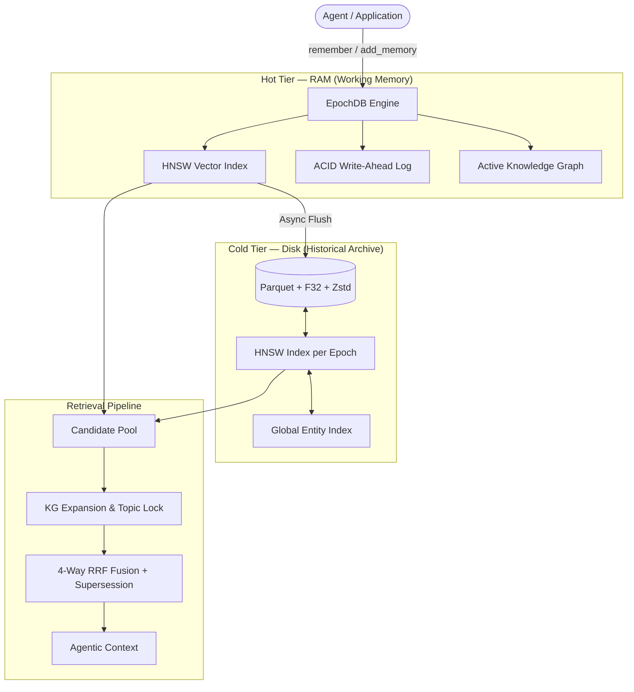

  

# How EpochDB Works

EpochDB is an **Agentic Memory Engine** that treats long-term memory as a tiered hierarchy. It moves beyond flat vector stores by integrating relational reasoning and atomic state management directly into the persistence layer.

---

## 1. Core Philosophy — Lossless Verbatim Storage

Traditional AI memory systems often use an LLM to *compress and summarize* conversations (e.g., rewriting *"I'm migrating to PostgreSQL for better JSONB performance"* into *"Likes PostgreSQL"*). This process is **fundamentally destructive**; context, nuance, and rationale are permanently discarded.

**EpochDB bypasses this.** It stores **Unified Memory Atoms** — raw, verbatim text paired with high-precision dense embedding vectors. Retrieval operates on original source material, ensuring the agent always has access to the full context.

---

## 2. The Tiered Architecture

EpochDB uses a tiered hierarchy modeled after CPU caches to balance performance and scale.

```mermaid
graph TD
    Agent([Agent / Application]) -->|remember / add_memory| Engine[EpochDB Engine]

    subgraph "Hot Tier — RAM (Working Memory)"
        Engine --> HNSW_H[HNSW Vector Index]
        Engine --> WAL[ACID Write-Ahead Log]
        Engine --> KG[Active Knowledge Graph]
    end

    subgraph "Cold Tier — Disk (Historical Archive)"
        HNSW_H -->|Async Flush| Parquet[(Parquet + F32 + Zstd)]
        Parquet <--> HNSW_C[HNSW Index per Epoch]
        HNSW_C <--> GEI[Global Entity Index]
    end

    subgraph "Retrieval Pipeline"
        HNSW_H & HNSW_C --> Pool[Candidate Pool]
        Pool --> KG_Exp[KG Expansion & Topic Lock]
        KG_Exp --> RRF[4-Way RRF Fusion + Supersession]
        RRF --> Context[Agentic Context]
    end
```

### Hot Tier (Working Memory)
Recent memories live entirely in RAM for sub-millisecond access:
- **HNSW Index**: Enables extremely fast approximate nearest-neighbor lookups.
- **ACID Write-Ahead Log (WAL)**: Every write is synchronized to disk before being committed to memory, ensuring 100% crash recovery.
- **Active KG**: Maps entities to atoms in real-time.

### Cold Tier (Historical Archive)
As epochs expire (or on demand), the Hot Tier is flushed to disk:
- **Parquet + F32**: Atoms are stored in Parquet files using **full float32 precision** to eliminate quantization noise.
- **Zstd Compression**: High-ratio compression for efficient storage.
- **Persistent HNSW Index**: Every epoch on disk has its own HNSW index, allowing the engine to search millions of historical atoms in milliseconds without $O(N)$ linear scans.

---

## 3. The 5-Stage Retrieval Pipeline

EpochDB uses a multi-stage pipeline to ensure perfect recall, even in high-noise or multi-hop scenarios.

### Stage 1: Parallel Semantic Hook
The engine simultaneously queries the Hot Tier HNSW and every Cold Tier epoch's HNSW index. It fetches a large candidate pool (`top_k * 10`) to provide enough surface area for subsequent rank fusion.

### Stage 2: Semantic Bootstrapping
If no explicit `query_entities` are provided, the engine extracts entities from the top 2 semantic hits in the Hot Tier (provided they exceed a 0.5 similarity threshold). This allows vector-only queries to "bootstrap" their way into relational reasoning.

### Stage 3: Global KG Seeding (Topic Lock)
The engine pulls ALL atoms associated with the query's entities from the Global Entity Index. This ensures that even semantically distant facts (the "Needle") are captured if they belong to the correct topic.

### Stage 4: Relational Expansion
For each atom in the candidate pool, the engine traverses the Knowledge Graph for $N$ hops (controlled by `expand_hops`). This connects disparate facts across different epochs, enabling multi-hop reasoning.

### Stage 5: 4-Way RRF Fusion & Supersession
This is the "brain" of EpochDB. It combines four distinct signals using **Reciprocal Rank Fusion (RRF)**:

| Pillar | Mechanism | Description |
|---|---|---|
| **Semantic** | RRF Rank | Proximity in embedding space. |
| **Recency** | RRF Rank | Strictly monotonic timestamps for deterministic ordering. |
| **Entities** | RRF Rank | Overlap with query entities (including expanded context). |
| **Topic Lock** | `+20.0` Bonus | A "nuclear" additive bonus for atoms matching the **original** query intent. |

#### Signal-to-Noise Filtering & Constants Design
The tuned constants used in the retrieval and filtering pipeline are designed based on mathematical bounds rather than fitting to specific benchmark data, ensuring they remain robust across different domains:
- **Topic Lock Boost (`+20.0`)**: In a standard RRF implementation with constant $K=60$, the maximum possible score an atom can accumulate from the ranking signals (Semantic, Recency, Entities, and Quantitative ranks) is:
  $$\text{Max RRF Score} = \sum \frac{w_i}{K + \text{rank}_i} \approx \frac{3}{60} + \frac{1}{60} + \frac{1}{60} + \frac{2}{60} \approx 0.117$$
  By applying a discrete `+20.0` additive boost (or $+15.0$ / $+10.0$ depending on predicate alignment), we establish a "hard lock" that is orders of magnitude larger than any possible RRF combination. This guarantees that intent-matched facts and entity seeds are mathematically guaranteed to outrank semantically adjacent background noise.
- **Signal-to-Noise Demotion (`1e-7`) / Soft Demotion (`0.1x`)**: When a Topic-Locked signal is found, background "noise" atoms are demoted (either by a multiplier of `1e-7` or a soft factor of `0.1x` depending on context). This forces background distractors down and preserves the prompt's context window.
- **State-Aware Supersession (`0.0001x` multiplier)**:
  EpochDB identifies "stale" facts by tracking Subject-Predicate pairs. Older atoms are penalized by a `0.0001x` multiplier, ensuring that if you tell the agent you moved from "Lisbon" to "Porto", the "Porto" atom always wins. Since $0.0001$ is far smaller than any standard RRF step, it effectively zeroes out the stale memory's relevance while leaving it in the verbatim history database.

#### Reconciling Lossless Verbatim Storage & Token Savings
There is a clear distinction between how EpochDB stores memory and how it feeds it back to the agent:
1. **Lossless Verbatim Storage (The DB)**: Unlike systems that summarize conversation histories via LLMs (which destructively discards details and nuance), EpochDB stores raw, verbatim texts and exact triples in its Parquet and HNSW indexes.
2. **Selective Retrieval (The Context)**: Token savings (typically 55% to 79%) are achieved because we do not feed the entire raw conversational history into the LLM context. Instead, we query EpochDB to selectively retrieve only the **top-k relevant, Topic-Locked facts** related to the active query. The context size remains flat and linear $O(N)$ with conversation length, rather than growing quadratically $O(N^2)$ as it does with standard message checkpointers (e.g. `MemorySaver`).

---

## 4. Crash Recovery & Resilience

On startup, EpochDB automatically replays the Write-Ahead Log (WAL). Any memory atoms that were in flight but not yet flushed to the Cold Tier are restored to the Hot Tier and Global KG. This ensures that even in the event of a hard crash, no data is lost.

---

## 5. Metadata & Configuration

| Parameter | Default | Purpose |
|---|---|---|
| `storage_dir` | `./.epochdb_data` | Root for all persistence. |
| `dim` | (Enforced) | Embedding dimensionality. |
| `epoch_duration_secs` | `3600` | Frequency of RAM-to-disk flushes. |
| `saliency_threshold` | `0.1` | Minimum cosine similarity for candidates. |

---

## 6. Integration: LangGraph Checkpointing

EpochDB includes a native `EpochDBCheckpointer` for LangGraph. It stores thread state as JSON alongside your long-term memories, providing a single, unified persistence layer for both agentic "short-term" state and "long-term" memory.

---

## 7. Quantitative Logic & Advanced Indexing (v0.6.2)

EpochDB v0.6.2 introduces native support for structured, non-textual data, enabling agents to reason about numbers, time-series, and logical rules with mathematical precision.

### The Quantitative Index Layer
Alongside the HNSW vector index, EpochDB maintains a parallel quantitative indexing subsystem:
- **Scalar Index (Interval Trees)**: Uses `IntervalTree` to index scalar variables with interval uncertainty (e.g., `temperature=22.5±0.5`). This enables $O(\log n + k)$ overlap range queries that bypass semantic search entirely, normalized via a persistent `schema_registry.json`.
- **Series Index (R-trees)**: Temporal-value pairs are indexed as 2D spatial points in an R-tree. This allows efficient range-temporal lookups and provides the foundation for series interpolation and aggregation.
- **Constraint Checker (SAT Solver)**: Integrated `z3-solver` evaluates complex logical expressions.
- **Reactive Cascades**: A `CascadeManager` automatically triggers downstream policy updates when quantitative constraints become infeasible. The dependency graph is persisted to JSON.
- **Statistical Reflection**: Uses Coefficient of Variation (CV) computed over the analytical cold tier to auto-generate policy atoms when trends become highly confident.

### Analytical Cold Tier
The Cold Tier has been upgraded with **`pyarrow.dataset`**. When performing analytical queries over historical data:
1. The engine identifies relevant Parquet partitions via the Global Entity Index.
2. `pyarrow.dataset` performs high-speed columnar scanning and filtering.
3. Numeric aggregates (mean, max, min) are calculated directly on the compressed storage layer without loading atoms into Hot Tier RAM.

### Unit Registry & Uncertainty
Quantitative atoms carry metadata for **Dimensional Analysis**:
- **Units**: Range queries automatically reject or convert mismatched units based on the `UnitRegistry`.
- **Uncertainty**: Measurement intervals (e.g., `±0.5`) propagate through series interpolation and constraint checks.

---

## 8. Memory Forking & Lineage (v0.6.2)

EpochDB v0.6.2 introduces **Logical Forking**. This allows an application to create a branch in the memory timeline without duplicating the underlying vector data.

### How it Works
When `db.fork(parent_epoch_id, new_epoch_id)` is called:
1. A new association is added to the **Global Entity Index** (`parent_epoch_id \u2192 forked_to \u2192 new_epoch_id`).
2. The retrieval pipeline can optionally traverse these fork links to include memories from "ancestor" epochs while maintaining a distinct "descendant" state.

This is particularly useful for:
- **Agentic Parallelism**: Multiple agents branching from a common knowledge base.
- **Hypothetical Reasoning**: Testing "what-if" scenarios in a separate memory branch.
- **Thread Isolation**: Isolating user conversations while sharing core system knowledge.
